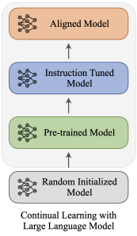

从零预训练LLM、SFT、RLHF、DPO笔记整理+面试问题

# 从0训练LLM🌤️


<aside>
🔥 base架构选择 →数据收集 →数据处理 →词表构建 →tokenizer →pre-training(PLM) →SFT →RLHF →评估迭代 →部署应用

</aside>

由于预训练任务的本质在于「续写」，而「续写」的方式并一定能够很好的回答用户的问题。既然模型知道这些知识，只是不符合我们人类的对话习惯，那么我们只要再去教会模型「如何对话」就好了。**这就是 Instruction Tuning 要做的事情，即指令对齐。**

<aside>
🤪 大模型训练是在巨大的解空间中搜索，每次出手都有巨大时间和经济成本，如何在最小成本下找到最优解

</aside>

参考网址：

1. 训练llama3-20M：https://github.com/Mxoder/LLM-from-scratch/tree/main 。 公众号记录：[https://mp.weixin.qq.com/s/Yf_NU3pgedLHl8dWAaMRfQ](https://mp.weixin.qq.com/s/Yf_NU3pgedLHl8dWAaMRfQ)
2. InternLM: A Multilingual Language Model with Progressively Enhanced Capabilities. 证明了训练数据可以分成多个阶段，进行课程学习也能提升效果。
3. Scaling Language Models: Methods, Analysis & Insights from Training Gopher. DeepMind证明了提升模型规模和提升数据质量同样重要，仅仅是大模型也做不好推理任务，但如果数据处理的好的话，模型的推理能力能大幅提升。
4. 数据处理的思考：[https://mp.weixin.qq.com/s/oKMLhw5hk0LP85dtRAzBDg](https://mp.weixin.qq.com/s/oKMLhw5hk0LP85dtRAzBDg)
5. karpathy大神训练1B的nanoGPT: [**https://github.com/karpathy/nanoGPT**](https://github.com/karpathy/nanoGPT)
[https://mp.weixin.qq.com/s/d1ypjLwaJKEV8Edfz83tVw](https://mp.weixin.qq.com/s/d1ypjLwaJKEV8Edfz83tVw)【**从零训练的 1B 以下小模型汇总**牛逼整理】
6. TinyLLama-1.1B模型训练：https://github.com/jzhang38/TinyLlama/blob/main/README_zh-CN.md【A100 *16 ，3个月，3万亿token,后面优化】
7. 训练的比较小而美：https://github.com/EleutherAI/pythia，有好多M级别checkpoints
8. 阅读了Allen实验室发布的关于[**OLMO模型**的技术报告](Accelerating the Science of Language Models)，大方地开源了整套大模型构建的代码，涵盖了数据处理、训练、评估等各个环节。**https://github.com/allenai/OLMo**
9. [MINI_LLM](https://github.com/jiahe7ay/MINI_LLM)，面壁智能的一位员工分享。知乎：https://zhuanlan.zhihu.com/p/684946331
10. [baby-llama2-chinese](https://github.com/DLLXW/baby-llama2-chinese)，教你从头训练以及SFT，证明数据和模型参数才是王道。
    
    
    
11. tokenizer到RLHF全流程，并支持下游任务sft微调，给出三元组信息抽取微调示例：https://github.com/charent/ChatLM-mini-Chinese/
12. 小项目：https://github.com/AI-Study-Han/Zero-Chatgpt
13. 




问题1：微软的工作 TinyStories小模型探索？

原工作用的是 GPT Neo 架构（可以看他们的 config），这个算是很老的模型了用来追踪复现gpt3，现在我改成llama3。像早期的一些语言模型如 GPT-2，即使在一些 Common Craw 这样的语料库上大量预训练后，也很难生成长的、连贯的文本。比如前几年有一种 AI 玩具类型是做文本续写，例如彩云小梦，可以写写作文、小说什么的，如果大家玩过就知道效果其实一言难尽，和今天的大模型完全没法比，其实这就是 GPT-2 level 的续写能力。

追问：那么为啥不行呢？

会不会是因为训练的语料库太多、太宽泛，需要学习各种语法元素、词汇、知识、推理等等，才导致小语言模型（SLM）没法有一个很好的表现。作者决定专注于一个任务——短篇故事续写，来探索一下 LM 的性能边界。

## 数据为王

问题1：数据痛点有哪些？

数据处理，**数据配比**，模型调优，评估方案透露很少。

但中文社区之前最大的数据集仍是Wudao-data，首先量级上和英文数据集完全不对等，Wudao-data仅包含大约53B的 token，而C4则是超过100B，RefinedWeb、ThePile、The Stack等数据集则是在500B token的量级。其次是质量，尽管Wudao-data经过了严格的清洗过滤，但我们还是发现有很多格式错乱、重复、数据质量低的问题。

按照现在开源模型与日俱增的训练数据量来看，后续开源的基础模型估计都得2T tokens起步了，否则效果难以比肩（按照scaling law来看）


**启智AI协作平台**

1. Wudao**开源200G、53B tokens**（闭源5TB，采用20多种规则从100TB原始网页数据中清洗得出最终数据集）：[https://openi.pcl.ac.cn/openihu/WuDaoCorpus2.0_base_200G/datasets](https://openi.pcl.ac.cn/openihu/WuDaoCorpus2.0_base_200G/datasets)
2. Falcon系列模型是在RefinedWeb数据集【纯英文】上训练的大语言模型。RefinedWeb数据集是基于CommonCrawl构建的高质量数据集，包含了经过去重和过滤后得到的包含上万亿tokens的数据集。**开源600G**（闭源5000G）-2.8TB -别人也就训练7B和40B
使用trafilatura进行文本提取，文档和行级别规则，NSFW URL黑名单
去重：精确和模糊匹配：精确子字符串 + MinHash（约50%被移除）
《The RefinedWeb Dataset for Falcon LLM:Outperforming Curated Corpora with Web Data, and Web Data Only》
3. **Skywork/Skypile-150B**数据集开源600G约150Btoken（闭源3.2万亿token）,包含大约166M个单独网页，平均每篇文章中文字符超过1,000页面中包含的经过处理和清理的文本 (并使用了FastText和BERT等模型移除了黄暴、低质量的内容) ，数据格式为jsonl，每一行为一个文档，按行用json进行解析，文本存放在text字段中。他们说好于wudao而且**最坦诚**的technical report
 闭源的用于**Skywork-13B**预训练：**详见https://github.com/SkyworkAI/Skywork** 预训练分为两个阶段：1、监督模型训练损失和CEVAL、MMLU等准确率变化。  2、第二阶段预训练在通用语料中额外加入STEM（数学，科学，工程，技术）相关数据继续训练。第二阶段训练大约130B token，两阶段总计训练3.2T，产生了我们最终的Skywork-13B-Base模型。
4. [**TigerBot](https://github.com/TigerResearch/TigerBot),** 基于 GPT3 的 pretrain 的数据分布，采集中文书籍，互联网，和百科类数据，并通过数据源质量分过滤和 tf-idf soft deduping，从 20TB 数据过滤到 2TB，保持语言和类目的比例，并在此基础上随机抽样 [**100G 数据开源**](https://github.com/TigerResearch/TigerBot?tab=readme-ov-file#%E9%A2%84%E8%AE%AD%E7%BB%83%E6%95%B0%E6%8D%AE)
    
    
    
5. [**书生·万卷](https://opendatalab.org.cn/OpenDataLab/WanJuan1_dot_0)多模态语料库,** 开源分为1,2版本。并且还包括图文数据集1.0和视频数据集。我们使用纯文本数据集1.0，来自网页、百科、书籍、专利、教材、考题等不同来源的清洗后预训练语料组成，数据总量超过5亿个文档，数据大小**超过1TB（中英混合）**。


[WanJuan2.0](https://opendatalab.org.cn/OpenDataLab/WanJuanCC)参考是从CommonCrawl获取的一个 1T Tokens 的高质量英文网络文本数据集，在各种验证集上的PPL表现出竞争力，特别是在要求更高语言流畅性的tiny-storys等集上。
• **数据量**：**约 100B Tokens（主要是英文为主）**；


1. 

人话-初级checkpoints

1-2-

问题2、预训练数据组成有哪些？

中英文各自：网页数据、社交媒体数据、百科全书、其他年报等，Github。当然构建领域数据评估模型好坏也很重要：

| 技术文章 | 电影评论 | 政务报告 | 游戏 | 金融 | 通用领域 |
| --- | --- | --- | --- | --- | --- |

### 1.1 数据经验

面壁科技minicpm作者关于预训练分享：

1、中英混合比例。逻辑推理比较强的样本，像代码，数学。这种就是**模型越大，混合的比例反而可以越高。**

2、导致ppl崩掉(困惑度异常高或不收敛)的，都要清洗掉，政治敏感数据清洗，去重等，肯定是一个很长的pipeline。

3、基于开源数据，做一些聚类的topic。然后基于这些topic，丢到更大的模型，来构建一批高质量的数据，是一个反而比较低成本的方案

问题1：不同训练阶段的训练样本有哪些方案？

1、**末期高质量样本（面壁科技minicpm)，**快速收敛阶段和平稳阶段，都采用普通样本。

退火阶段【学习率或其他超参数逐渐降低，以帮助模型更好地收敛到稳定的最优解】，混入高质量样本来做教科书式的学习【提升模型的最终性能】。

2、初期高质量样本。先高质量为主让模型快速收敛后添加更多普通样本

3、**全程高质量样本（PHIL方式）。**PHIL就是探索小模型能不能在特定领域达到SOTA。**好处，特定榜单/领域效果会特别好。坏处，模型泛化能力会很差**（但PHIL从来没说要做世界模型。

问题2：数据配比太重要了，有哪些trick?

参考BloombergerGPT，就会发现模型的能力其实很差，比通用大模型会差很多。这里面犯的最大的错误就是数据配比，他们应该是用1:1的比例混合通用数据和金融数据。

1、预训练时，通用数据和领域数据绝对不能1:1。对于复现chatgpt3.5来说，**数据配比应该是OpenAI最核心的秘密**和比别人领先最后的地方。

2、二次预训练时，领域数据比例要在15%以下，一旦超过这个阈值，模型的通用能力会下降很明显。这个结果其实和ChatGPT大概用不到10%的中文数据就能得到一个很不错的中文模型的结果还挺相似的，每100B的领域数据，需要配上700B-1000B的通用数据，这比直接训练通用大模型要困难多了。

3、sft时，其实领域数据和通用数据比例在1:1的时候还是有不错的效果的。当然，如果sft的数据量少，混不混数据的差别就不太大了。（比预训练好多了🧋）

### 1.2 数据处理

[https://mp.weixin.qq.com/s/oKMLhw5hk0LP85dtRAzBDg](https://mp.weixin.qq.com/s/oKMLhw5hk0LP85dtRAzBDg)

问题1：预训练的数据可以分为哪两类？

一类是网页数据（web data），比如非盈利性机构构建的CommonCrawl数据集(5000G过滤后)是一个海量的、非结构化的、多语言的网页数据集。它包含了超过 8 年的网络爬虫数据集，包含原始网页数据（WARC）、元数据（WAT）和文本提取（WET），包含数百亿网页，数据量级在PB级规模

二类称之为专有数据（curated high-quality corpora），为某一个领域、语言、行业的特有数据。比如对话、书籍、代码、技术报告、论文考试等数据。

问题2：专有数据有多难开源的？

就拿高质量的book书籍数据来说，在网上能直接获取到数据来自The pile中的Book3，量级也才85GB左右，和这些巨头所用数据量级相差数十倍（Books – 2TB）。

问题3：文本去重和存储推荐啥格式？

推荐使用`parquet`格式（列式存储格式，只读取相关的列, Hadoop 生态系统开发/həˈduːp/）存储数据，可以大大减小存储占用

推荐使用`Minhash`去重，效果优于Simhash，但时间消耗长！（[参考](https://github.com/DLLXW/baby-llama2-chinese)）

问题4：数据处理过程？

根据分析得到的数据集特征，调整配置文件，再进行数据处理：
· 数据处理30法则：若某个数据点超出均值±30的范围，通常被视为异常值
· **先进行筛选，再过滤**，能减少数据处理的时间

好数据模板：


> LLama，Falcon等模型已经证明，预训练中大部分使用网页数据可以训练出非常不错的大模型。
> 

智源社区：[https://hub.baai.ac.cn/view/30442](https://hub.baai.ac.cn/view/30442)

## scaling law

由OpenAI在2020年提出，经验公式：

<aside>
🤪 **模型性能1倍  ∝ log(模型参数) ∝(模型数据)^(0.3~0.5) ∝ log(计算资源)**

</aside>

根据scaling law，模型越大，高质量数据越多，效果越好。

但还有一个很直观的情况，随着预训练样本的质量不断提升，训练手段的优化。新的模型，往往效果能轻松反超参数量两倍于它的模型。

 《**Scaling Laws for Neural Language Models**》 模型的最终性能**「主要与」**计算量，模型参数量和数据大小三者相关，而与模型的具体结构(层数/深度/宽度)基本无关。假定计算量整体放大10倍，OpenAI认为模型参数更重要，模型应放大 (5.32)倍，数据放大 (1.86)倍；后来DeepMind和Google认为模型参数量与数据同等重要，两者都应该分别放大 (3.16)倍。

不过LLama认为这个观点是针对**「训练阶段」**而言的，并不是**「推理阶段」。尽管根据Scaling Law，`10B模型只需要200B的数据( Chinchilla 定律)，但是作者发现7B的模型性能在1T的数据后还能继续提升`。**

过拟合程度与模型大小和数据集大小的比例有关。每增加8倍模型参数,只需增加约5倍数据就能避免性能损失。

故事： 

> 但我们回到2020年，当大部分人都在基于bert做各种魔改的时候。OpenAI发现了这么一个规律。数据，训练参数一直增长下去，好像loss的确是在不断的下降哎？于是，他们拿着这个paper去问微软的CTO，你想不想看看这个loss下降到一定程度会发生什么？会发生什么
chatgpt就出来了
> 

## **Tokenizer**

LLaMA 2 的分词器，二代的词表比较小（32k），LLaMA 3 的词表太大了（128k），在 SLM 中会占用太多的参数比重，并且这只是个专有任务数据训练，没必要用太大的词表。[QWEN-1.8b]

> **分词后一个中文大概1~3token占用，每一个token只需要两个字节（uint16存储）**
> 

问题1：自己构建分词器还是用别人的？

推荐直接用别人的，**glm2（词表大小=64793）**和qwen的词表中文都很好（llama官方所提供的词表中，中文的部分只有700个，这也是llama中文能力聊胜于无的原因），而且压缩率很高。baby进行过实验，小模型的分词器其实影响不大：


追问：如果自己构建tokenizer有哪些方法？

tokenizer到词表构建有三种[token子词划分算法]：BPE(Byte-Pair Encoding)、WordPiece、SentencePiece
1、**BPE：统计每个连续或相邻`字节对`出现频率【传统的以字符为单个token而非字节，apple字符=[a,p,p,l.e]】，将最高频的连续字节对合并为新的子词**。    GPT2、LLaMA
2、WordPiece：将能够提升LM概率最大的相邻子词进行合并加入词表 。例如BERT            
3、SentencePiece：把空格当成一种特殊字符处理。例如ChatGLM、PaLM

追问1：BPE在中文语料库构建分词器有什么局限？

BPE提出在英文字符处理多字节的高频字节对合并，英文字符通常是单字节的，因此 BPE 分词器通过字节对的合并操作能够生成合理的子词。但是`中文字符~2-3个字节`，**BPE 可能会错误地将这些字节视为独立的字符或部分字符进行处理，导致在编码过程中将一个完整的汉字拆分成多个错误的字节组合**。如果编码不是UTF-8，解码时会乱码。

追问2：那针对中文的分词解决方案？

在训练 BPE 分词器时，可以考虑使用基于字符级别的分词器（例如 `BertTokenizer`）或使用专门为中文设计的分词方法，如 Jieba 或 `SentencePiece`。这些工具对中文的处理更友好。

- `BBPE（Byte-level BPE`）通过将字节作为基本单元进行分词，克服了传统 BPE 在处理多字节字符时的局限性。它的语言无关性和对所有 Unicode 字符的支持，使其成为多语言模型分词的理想选择。
- BBPE[Byte-level BPE]分词流程举例子【将单词拆分为字符序列并在末尾添加后缀“ `</ w>`”，统计单词频率】
    
    在 BBPE 中，该句子的处理流程如下：
    
    1. 将每个字符编码为字节序列：
        - “你” -> `E4 B8 8B`
        - “好” -> `E5 A5 BD`
        - “吗” -> `E5 90 97`
        - “？” -> `3F`
    2. BBPE 根据频率统计合并高频字节组合，可能最终将 `E4 B8 8B`、`E5 A5 BD` 等组合为单独的子词。
    3. 最终，编码器将输入句子编码为字节组合序列。

~~问题1：为什么分词批量填充时padding_side='left’？~~

对于 decoder-only 的模型做生成任务是必要的，因为我们本质上做的是 next token prediction，如果 pad 挡在了生成序列的右边，会影响到模型生成。

问题2：自回归语言模型训练用的分词器处理是啥函数？

使用 `DataCollatorForLanguageModeling` 进行自回归语言模型训练时，通常会对输入序列进行填充，并生成相应的标签用于预测下一个token。【不做MLM完型填空任务其实就是token预测】

- 分词预测代码
    
    ```python
    # DataCollatorForLanguageModeling
    dc = DataCollatorForLanguageModeling(tokenizer, mlm=False)  
    data = ['南京', '南京市', '南京市长江']
    
    raw_tokens = [tokenizer(text) for text in data]
    
    print(f'tokenizer.pad_token_id: {tokenizer.pad_token_id}\n')
    print(dc(raw_tokens))
    
    '''
    tokenizer.pad_token_id: 151643
    
    {
        'input_ids': tensor([[151643, 151643, 102034],
                             [151643, 151643, 112891],
                             [102034, 102975,  69177]]),
        'attention_mask': tensor([[0, 0, 1],
                                  [0, 0, 1],
                                  [1, 1, 1]]),
        'labels': tensor([[  -100,   -100, 102034],
                          [  -100,   -100, 112891],
                          [102034, 102975,  69177]])
    }
    '''
    labels 确实是 input_ids 的原位复制，区别在于 input_ids 里用 pad_token_id 来填充，labels 里对应的是 -100、表示不计算 loss
    ```
    

追问：DataCollatorForSeq2Seq 和 DataCollatorForLanguageModeling区别是啥？

DataCollatorForSeq2Seq：用于序列到序列任务，处理输入和输出序列对，适用于机器翻译、文本摘要等任务。
DataCollatorForLanguageModeling：用于语言模型任务，处理单个序列，适用于掩码语言模型和自回归语言模型（Causal Language Modeling, CLM）的训练。

问题3：为什么tokenizer压缩率高了好？

比如Qwen的分词器就很好，首先压缩率指的是tokenizer将文本转换为token序列时的效率和效果。压缩率越高，代表相同文本内容时，生成的token序列更短，每个token包含信息量更大。这样的好处使可以减少计算消耗，提高模型效率，降低数据冗余。

问题4：分词器处理数据如何存储的？

数据预处理采取GPT的通用做法，对语料进行提前分词，对一个样本做完分词后在末尾加上一个结束符号`<eos>`，与下一个样本区分开。然后将所有的训练语料拼接成一个数组（`np.uint16`）**以.bin二进制格式存储到磁盘上**。如果语料过大，避免内存溢出，可以选择mmap格式。

追问：uint16是啥？mmap格式是啥？

uint16是Unsigned 16-bit Integer，非负整数，占2字节，比传统int32(有负的)节约一半内存存储。

**mmap（内存映射文件）**是一种用于将文件或文件的一部分映射到进程的地址空间的技术。这**使得文件的内容可以像在内存中一样进行访问，而不需要将整个文件加载到内存中—-多进程可以通过映射共享文件数据防止多次IO操作**。【以像操作内存数组一样操作文件内容。这种方式可以提高文件I/O操作的效率】

问题5：special_tokens在预训练中的作用？

假设tokenizer.special_tokens['<eos>']=2，这个和tokenizer本身SentencePiece 也将 </s> 定义为 2要进行明确，可以覆盖。然后在预训练阶段我们通过这个token_id=2也就是<eos>来分割文本之间。假设输入[30910, 56961, 2, 54640] →decode后为‘昭通’； 实际[30910, 56961, 54640] →decode后也为‘昭通’。**这个2在字符串是没有任何意思的，但是对模型输入是有很大用的，他占了一个token位置，并且会参与attention计算**，所以之前有学者**SoftMax-off-by-One做文章，防止(量化或流式部署时有问题)，97% 以上的异常激活发生在空格和标点符号位置上**

- 代码实现
    
    ```python
    import sentencepiece as spm
    import torch
    sp = spm.SentencePieceProcessor()
    sp.load('./chatglm_tokenizer/tokenizer.model')
    X = torch.tensor([[30910, 56961, 2, 54640]], device='cuda:0')
    tokens_list = X[0].tolist()
    print(sp.decode(tokens_list))
    # 想查看tokenizer.special_tokens['<eos>']=2 也就是说<eos>位置
    print(((X[0] == 2).nonzero(as_tuple=True)[0]).tolist())
    ```
    

问题6：embedding层参数为啥不宜过大？

为了避免模型头重脚轻，所以词表和embedding层参数不能太大。如果embedding层的参数占比过高，导致过拟合模型可能会更容易记住训练数据而不是学习到通用的特征。并且浪费推理资源而且embedding层的影响可能会掩盖其他层的效果，使得调参过程复杂化。

问题7：如何训练自己的BPE分词器？

**调用tokenizers库里的方法，初始化tokenizer，设置BPE训练器和设置词汇表大小3.2w，将文本yield逐句读取训练，同时设置字符级解码**。如下代码

- tokenizer训练代码
    
    ```python
    # 初始化tokenizer
        tokenizer = Tokenizer(models.BPE())
        tokenizer.pre_tokenizer = pre_tokenizers.ByteLevel(add_prefix_space=False)   # 处理字节级文本的预处理器
        
        # 设置训练器
        trainer = trainers.BpeTrainer(
            vocab_size=32000,    # 创建一个 BPE 训练器，设置词汇表大小为 32000
            show_progress=True,
            initial_alphabet=pre_tokenizers.ByteLevel.alphabet()   # 初始化训练器的字母表
        )
        
        # 读取文本数据
        texts = read_texts_from_json(data_path)   # 逐个句子读取
        
        # 训练tokenizer
        tokenizer.train_from_iterator(texts, trainer=trainer)
        
        # 设置解码器
        tokenizer.decoder = decoders.ByteLevel()   # 用于将分词后的字节级别标记转换回文本
        
        # 保存tokenizer
        tokenizer_dir = "./miaomiao_tokenizer"
        os.makedirs(tokenizer_dir, exist_ok=True)
        tokenizer.save(os.path.join(tokenizer_dir, "tokenizer.json"))
        tokenizer.model.save("./miaomiao_tokenizer")
    ```
    

最主要、手动添加特殊标记。

1、这里添加`system`, `user`, `assistant，<|endoftext|>`等为词表外的特殊解码词，

2、另外指定`"additional_special_tokens": ["<|im_start|>", "<|im_end|>"]为特殊tokens【这个占了token_id，但解码后没有任何意义，GPT4输入这个都会当成空】`

3、最后`bos_token`, `eos_token`, `pad_token`, `unk_token` 是常用的特殊 token，分别表示句子的开始、结束、填充和未知 token。这里配置为空或 `None`。其中`"eos_token": "<|im_end|>”+"pad_token": "<|endoftext|>",`
—-——-—chat_template配置也在分词器构建进行———-

模板中使用了 `Jinja2` 风格的语法

"chat_template": "{{ 'system\n你是一个由喵阿姨开发的喵喵小助手\n' }}{{'' + message['role'] + '\n' + message['content'] + '' + '\n'}}{{ 'assistant\n' }}”

问题8：BPE生成哪些分词信息文件？

merges.txt（存储了 BPE 合并规则）和vocab.json（ token 到 token ID 的映射）。这两个文件包含了BPE算法所需的核心信息。

tokenizer_config.json（配置了分词器的相关参数，如 tokenizer 类、特殊标记等），tokenizer.json（通常包含完整的词表、BPE 合并规则）


## 混合精度

问题1：vLLM是啥？

答：vLLM 采用一种**集中式调度器**（scheduler）来协调分布式 GPU 工作器（worker）的执行。KV 缓存管理器由 PagedAttention 驱动，能以分页方式有效管理 KV 缓存。

v100不支持bf16, 改用fp16吧。

问题2：**bf16和fp16区别？**

都是半精度，2字节。BF16可表示的整数范围（指数位）更广泛，但是尾数精度较小（有效精度尾数位）；FP16表示整数范围较小，但是尾数精度较高。


**问题3：显存占用有哪些？**

四部分：模型权重+优化器、梯度、动量等+前向激活值+cache


**问题4：激活显存（Activation Memory）是啥作用？如何节约显存占用**

激活显存（Activation Memory）指的是在深度学习模型的前向传播和反向传播过程中，存储中间激活值所需的显存。这些激活值是神经网络每一层的输出，它们在反向传播阶段用于计算梯度。

**激活显存 = 每一层输出D × 批次B × 序列长度L × 2bytes (所以训练加载如果激活要预留一般显存)**

追问：所以如何管理显存占用呢？ 

— **梯度检查点**（Gradient Checkpointing）：通过在前向传播过程中有选择地存储激活值，在需要时重新计算未存储的激活值，以减少显存占用。

— **混合精度训练**（Mixed Precision Training）：使用FP16而不是FP32来存储激活值，可以显著减少显存占用。

—**分布式训练**（Distributed Training）：将模型和数据分布到多个GPU上，可以有效地分摊激活显存的需求。

—**调小batch**,或者**累计梯度**模型大batch的训练效果

问题5：在反向传播时对梯度计算有做什么处理？

梯度剪裁，在1阈值进行基于梯度L2范数的裁剪，不过剪裁前需要先取消缩放（unscale）这些梯度【考虑到混合精度+累计梯度对loss、优化器的缩放】。在反向传播时防止梯度爆炸，从而确保训练过程的稳定性对深层网络结构友好。

实现：=================
           `scaler = torch.cuda.amp.GradScaler(enabled=(dtype == 'float16'))
     scaler.unscale_(optimizer)   
    torch.nn.utils.clip_grad_norm_(model.parameters(), 1)`  

追问5：混合精度训练通过什么实现的？

首先，混合精度上下文管理器 (`torch.cuda.amp.autocast()`),
大多数的计算会使用 `float16` 进行加速和节省显存，只有在需要较高精度的操作（如 `softmax`）时会自动回退到 `float32`.
`torch.cuda.amp.**GradScaler`【**在反向传播之前，将损失放大，这样即使在 `fp16` 精度下计算，梯度值也足够大，避免因数值精度问题导致梯度消失**】** 负责在训练过程中动态调整缩放因子，以避免数值不稳定的情况。也就是**在正向计算保存为fp16,反向梯度更新要还原为fp32。**

## 优化器

问题1：**优化器和LR scheduler如何协同工作？**

首先，优化器负责更新模型参数以最小化损失函数（比如Adam会维护一些内部状态，比如动量、学习率调整影响 参数更新 的方式），而学习率调度器负责动态调整学习率，以便在训练过程中更好地控制参数更新的步长。

<aside>
💨 **SGD和Adam的收敛性证明也都是要求learning rate最后会降到足够低的。但自适应优化器的学习率不会在训练中自动降到很低。所以需要搞了俩油门，互相辅助。在训练时用Adam优化器，然后调度器让学习率符合W-S-D策略。**

</aside>

问题2：什么是**W-(C)-S-D策略<—学习率策略？**

改进：`Warm-Cosine-Stable-Decay`  【warmup预热+余弦退火策略+最小学习率收尾】

- Warmup：与现有策略相同，初期阶段逐渐增加学习率。
- Cosine：在训练的主要阶段，采用**余弦退火（Cosine Annealing）策略。学习率按照余弦函数变化，逐渐减小到一个最小值**。这种策略有助于在训练过程中跳出局部最优，因为学习率会周期性地增大和减小。
- Stable：**在训练即将结束时**，将学习率升高到一个稳定值。这段时间内，模型以稳定的学习率进行训练，有助于模型在新的学习率下找到更优的解。
- Decay：在训练的最后阶段，逐渐减小学习率，以帮助模型收敛到最终的解。
- lr代码
    
    ```python
    def get_lr(it):
        # 1) 线性 Warmup从0开始增到0.1
        if it < warmup_iters:
            return learning_rate * it / warmup_iters
        # 2) if it > lr_decay_iters, return min learning rate
        if it > lr_decay_iters:
            return min_lr
        # 3) 余弦衰减to min learning rate
        decay_ratio = (it - warmup_iters) / (lr_decay_iters - warmup_iters)
        assert 0 <= decay_ratio <= 1
        coeff = 0.5 * (1.0 + math.cos(math.pi * decay_ratio)) # coeff ranges 0..1
        return min_lr + coeff * (learning_rate - min_lr)
    ```
    

追问：还有余弦退火策略的步长控制建议？  🉐  🉐  🉐

<aside>
❤️‍🔥 参考`Chinchilla`在Deepmind发布的论文《**Training Compute-Optimal Large Language Models**》实验，建议
**①最优的训练数据量（tokens）应是模型参数数量的 20 倍。（模型0.1b,那么应该20b tokens）
②余弦退火的循环周期步长建议设置在总步长的（1-1.25倍）【扩充如果要采用上面decay策略收尾，则建议lr_decay_iters 可以设置为 max_iters 的 80% 到 90%】，允许在训练的早期阶段保持较高的学习率以促进探索，然后在训练的后期逐步降低学习率，以实现更精细的收敛。  
 ③建议最小学习率为初始学习率【一般设置3e-4 】的0.1倍[所以我设置 1e-5]。④warmup_iters预热 通常设置为总步数的5%-10%**

</aside>

<aside>
🚵🏻‍♀️ **余弦退火步数为啥能超过总步长**？因为余弦退火周期设置为 110,000 步，意味着在训练结束时，余弦周期完成了约 90.9%，相当于以这个小学习率收尾。当然我们也可以直接用min_lr训练收尾。
========具体例子：假设总的数据128w，batch=32，4卡分布式，那么迭代总步长=1w步。我可以设置warmup_iters = 500 ，lr_decay_iters = 9000，min_lr = 1e-5 ，learning_rate = 3e-4
========扩展问题：总的数据128w，batch=16，梯度累计gradient_accumulation_steps=4，4卡分布式，请问这时迭代总步长是多少？
答案：`1280000 /(16*4*4) = 5000` 步

</aside>


在使用余弦退火策略时，合理设置周期长度的重要性。建议在目标步长的110%~120%之间，不要超过25%！！！

> **lr高→探索，低→微调/稳定**
> 

问题3：配置优化器的部分为什么，大于或等于2D(维度>2D)的参数会被衰减，小于2D不会衰减？

神经网络参数的维度决定了其自由度。**对于大于或等于2D的参数（如权重矩阵），通常应用权重衰减以限制参数大小，减少过拟合风险**。对于小于2D的参数（如偏置向量），通常不应用权重衰减，因为其对模型复杂度影响较小。通过为不同参数组设置不同的衰减策略，可以更有效地控制模型复杂度。

问题4：自定义的学习率策略在代码如何实现参数更新？

get_lr()指定策略动态计算当前迭代的学习率，再更新到torch自带`optimizer.param_groups`中优化器中各参数组的学习率[’lr’]，从而控制模型训练过程中参数更新的步长。

## 评价指标

[syk-benchmark评价指标]

问题1：预训练和微调评价指标不同？

比起预训练（Pretrain）环节里相对明确的评价指标（如PPL、NLL等），

NLL 是指负对数似然（Negative Log-Likelihood），希望最小化（=最大化训练数据的似然）拟合最好。


Instruction 环节中的评价指标比较令人头疼。BLEU 和 ROUGH 这样的指标已经不再客观 ×

像 [FastChat] 中一样，利用 GPT-4 为模型的生成结果打分  √  人类打分  √

问题2：如何对预训练阶段模型评估？

传统的评估主要看的是Training loss或者Benchmark上的指标。但是有缺陷：

1、Training loss因为数据配比的原因是一个整体的指标，并且不同模型不能相互比较。比如代码占比越高，其实loss会更低因为结构更容易预测。

2、Training loss第二个问题是可能会选择出一个更加过拟合的模型

3、Benchmark的问题就更加严重了，第一是因为benchmark是公开数据，非常容易针对。Benckmark评估具有一定的波动性&可操作性而且评估是准确率（不连续的指标），不同Prompt选择和答案提取方式会对结果产生很大的影响

因此还有一种方法，**构建了中文，英文，代码，arxiv文章等多个领域的验证并且没有出现在训练数据中。通过Cross Entropy损失函数，整体的损失函数为每个位置预测真实词损失的平均 ——来监控模型训练效果**（参考skywork预训练）

追问：grokking现象是啥？

在前几轮的训练中，模型的损失函数（loss）持续下降，但准确率没有显著提高。突然，在某一轮训练之后，模型的准确率大幅提升。这种现象可以被描述为模型“grokking”了任务。（也就是用准确率是不连续指标，它提醒我们模型性能的提升有时并不是线性的，而是可能在训练的某个阶段突然发生）

问题3：评估时为啥要让所有模型的文档长度一样，而不是让分词后token一样？

本质上领域困惑度是衡量不同模型生成高质量文档的概率，概率越大模型效果越好，因此我们需要保证所有模型看到的文档是一样的。此外，因为不同模型使用不同的分词器，分词后的token数目差异很大，以Llama为例，会将汉字切分为3个unicode编码，如果按照分词后token比较的话，那么Llama模型看到的文档长度会比其他模型短，而我们知道文档前面的token loss是更低的，后面token loss更高，因此按照分词后token比较的话会对Llama这种分词更细的模型会不公平。

问题4：评测数据的指标如何计算，比如常用的acc分数？

这里拿`MMLU综合语义理解`数据评测计算举例子，可以参考/home/ph/LLM/Skywork-main/data/。

首先介绍下MMLU测评数据4个文件夹组成（基本都是多选题，出的还挺难）：1、Auxiliary Training（用于微调模型来源于多项选择数据集如MCTest、RACE、ARC、OBQA）       2、**Dev , 用于少样本学习few-shot**     3、**Test, 内容最多用于最终评估模型性能**   4、Val, 验证集通常用于在训练过程中监测模型的性能

CMMLU中文测评集如下：


- CMMLU子类69个领域：
    
    ["农学", "解剖学", "古汉语", "艺术学", "天文学", "商业伦理", "中国公务员考试", "中国驾驶规则", "中国饮食文化", "中国外交政策", "中国历史", "中国文学", "中国教师资格", "临床知识", "大学精算学", "大学教育学", "大学工程水文学", "大学法律", "大学数学", "大学医学统计", "大学医学", "计算机科学", "计算机安全", "概念物理学", "建设工程管理", "经济学", "教育学", "电气工程", "小学语文", "小学常识", "小学信息技术", "初等数学", "民族学", "食品科学", "遗传学", "全球事实", "高中生物", "高中化学", "高中地理", "高中数学", "高中物理学", "高中政治", "人类性行为", "国际法学", "新闻学", "法理学", "法律与道德基础", "逻辑学", "机器学习", "管理学", "市场营销", "马克思主义理论", "现代汉语", "营养学", "哲学", "专业会计", "专业法学", "专业医学", "专业心理学", "公共关系", "安全研究", "社会学", "体育学", "中医中药", "病毒学", "世界历史", "世界宗教"]
    

然后，

追问4：常见可以用来给中文评测的数据集除了CMMLU还有哪些经典的？

全面的中文基础模型评测数据集`C-Eval`，由13948道多选题组成涵盖了
52 个学科和四个难度的级别。


问题5：除了将测评做成选择题分类【大部分结合prompt都是做分类输出】计算acc，对于生成式回答需要啥其他指标？

Rouge（用于摘要生成任务，特别是在评估覆盖率），BELU（也不合理，只看到了局部n-gram相似）  这两个都是基于浅层匹配的指标，对语义等价的多样化表达不敏感。

## 模型架构

问题1：LLama2的架构特点有哪些？

首先，相比llama1增加如下，llama3架构其实和2一样，只是数据更好更庞大了。

1、前置的RMSNorm，相比传统的LN减少了计算均值操作更快。为啥前置pre而不是post呢？因为输入前归一化有助于保持梯度在网络中更稳定地传播和深层叠加【如果在输出再归一，梯度在子层内已经过大变化，可能产生梯度消失或爆炸，不利于梯度稳定训练】GPT-3 和其他类似的模型在设计中都这样

2、在QK上使用ROPE旋转位置编码

3、使用causal mask保证每个位置只能看到前面的tokens

4、down(up(x)×Silu(gate(x)))，里面都线性层。用SwiGLU （效果类似平滑版的ReLU）代替了传统的 ReLU 激活函数

5、使用GQA代替MHA

## 预训练tricks

问题1：多阶段渐进式预训练（Multi-phase Progressive Pretraining）是啥？【预训练策略】 
-比如在InternLM

根据前一阶段的学习情况和侧线实验的结果,调整各个阶段的数据组合和学习设置。每个阶段都有特定的能力发展目标，还要考虑数据配比和上采样，可能在不同阶段使用不同的数据组合，**可能涉及更复杂的课程学习策略**。

追问：它和增量预训练（Incremental Pretraining）的区别是啥？

增量预训练通常是在原有模型基础上添加新数据训，而非混合。（通常更关注于如何有效地整合新数据，当然可以做点小样本高质量配比）

问题2：阶段式训练是咋样的？

比如**TinyLLama-1.1B**放出来的所有中间checkpoints，可使用FSDP、flash attention 2、fused rotary positional embedding。（**24k tokens/秒/A100**）


问题3：**预训练时有哪些坑？**

1.多卡的话最好设置ddp_find_unused_parameters=False,这样也能提升训练的速度

2.尽可能地把单个bs调大，因为我试过把单个bs没有调那么大，通过使用累积梯度步数来增大总的bs，但是收敛的没有把单个bs调大快，我在想这个和学习率调整有关。【数设置上有两个地方需要注意：一个是学习率需要略小，在e-5这个量级就可以，**其次是global_batch需要比较大，一般在2-4M tokens，这样训练起来会比较稳定**】

3、不说并行分布式计算的效率问题，听说国内某个top 3科技巨头用2000卡训练，中途有卡崩溃，他们花了2天才找到是哪张卡出故障 

4、无法从收敛曲线去预测模型的实际效果

5、过拟合的问题：只用领域数据非常容易过拟合到领域数据上，对OOD的处理会表现的非常差。对各个环节的数据配比要求会很高，最好是在原来规模程度的数据上，增加额外的场景数据，重新走部分流程。**但是困难的是，原有数据保持分布的采样，你拿到的模型是个黑盒，别人并没有给你原始的数据分布，更何况海涉及到了惊细的清洗**。有可能整体要付出的成本不下于重新塑造一个通用大模型。

6、需要分布式训练系统的开发工程师，负责把训练框架给支起来，协调、运维和管理这么多机器。

追问：上面第5点过拟合，OOD问题如何避免？

首先OOD（Out-of-Distribution）由于如果分阶段训练简单数据和复杂数据在分布上有显著差异，模型可能难以适应新的数据分布。因此一定要有合理数据配比，混合使用简单和复杂的数据才能让模型减小过拟合可能。另外构造优秀的验证集评分（最好有个综合验证集减少偏差，当然也可以加点当前那阶段特定验证评估）可以定期监控模型的好坏实现早停或者说打断。

问题5：FP32/FP16/BF16的选择问题？

更倾向于BF16，因为看起来更好收敛

问题6：并行计算方案的选择？

Megatron-DeepSpeed是现在比较SOTA的一个方案

问题7：断点续训要保存checkpoint哪些东西从中断出继续加载？

--resume_only_model: 默认为False, 即为严格的断点续训, 这会**读取模型、优化器和lr_scheduler的权重和各个设备存储的随机种子, 并将从上次训练暂停的stpes后继续计数进行训练**. 如果设置为True, 则只读取模型的权重.

问题8: 预训练`X,Y`如何划分？

按照seq_len划分，例如1024，则X[:-1]为(batch, 2013 ) 去预测 Y[1:]为(batch,1023)

`logits = self.output(h)`   # [32, 1023, 64793]

`self.last_loss = F.cross_entropy(logits.view(-1, logits.size(-1)), targets.view(-1), ignore_index=-1)`

**在一批次所有样本和所有有效位置【忽略token_id = -1，为处理填充标记（`padding tokens`）】上取平均交叉熵损失**。

-但我好像没有填充标记过滤

问题9：ROPE是作用在哪一部分？

<aside>
✂️ 对token进行embedding+dropout后,假设有N个Transformer块blocks,那么每次输入qkv拆分多头x=[32, 1023, 8, 64]时，加入ROPE（复数 -实部+i虚部，**先作用在Q、K上加入旋转矩阵后，再计算attention score**）,当前block输出[32, 1023, 8, 64]，反复执行N个TFblock[包括attention+FFN]。最后经过RMSNorm+vocab_Linear输出词表概率。

</aside>

问题10: 权重初始化使用了什么策略？

一般使用基于正态分布的初始化。

比如**普通线性层 (nn.Linear) 和嵌入层 (nn.Embedding)** 的初始化使用均值为 0.0，标准差为 0.02 的正态分布，如果存在偏置，则使用零初始化 (torch.nn.init.zeros_)。

然后**残差连接中的投影层**(以 'w3.weight' 或 'wo.weight' 结尾的层)基于 GPT-2 论文中的方法，使用均值为 0.0，标准差为 0.02 / sqrt(2 * params.n_layers) 的正态分布进行初始化。

问题11：用了什么注意力机制代码？

实现：**`torch.nn.functional.scaled_dot_product_attention**(xq, xk, xv, attn_mask=None, dropout_p= 0.0, is_causal=True)`

专注于计算单个注意力头的**缩放点积注意力(SDPA)** ，~~这个参数不涉及多个头的并行计算和最终的线性变换~~。使用 PyTorch 的高效矩阵运算（如点积和转置）来加速计算，缩放因子其实就是`1 / sqrt(d_k)`。【默认使用flash attention2优化内存管理】

追问：新版torch.compile(model)有啥作用？

`torch.compile(model)` 擅长消除与 PyTorch 相关的框架开销。当模型中包含大型、高效的 CUDA 内核时（例如 CausalSelfAttention），这种优化尤为明显

torch.compile(m, backend="tensorrt")：使用 Torch-TensorRT 进行推理优化-**解决在 PyTorch 中准确捕获计算图的问题,也可以转成"onnxrt"**

### 关于算力部分

- 在一个月内训完Llama2至少也需要4500张A100-80G; llama是2048块A100一个月
- [nanoGPT](https://github.com/pihang/nanoGPT),  DDP（还可使用FSDP进行多GPU和多节点分布式训练），reproduces GPT-2 (124M) on OpenWebText, running on a single 8XA100 40GB node in about 4 days of training（OpenAI 的 WebText 数据集55.21 GB训练集）
- [**TinyLlama-1.1B](https://github.com/jzhang38/TinyLlama/blob/main/README_zh-CN.md)，在3万亿tokens(开源也就1500亿)上进行预训练。经过精心优化，我们"仅"需16块A100-40G的GPU，便可在90天内完成这个任务。各种优化完后**达到**24k tokens/秒/A100**的训练速度[如果塞入A100-40G，16k tokens的per-gpu batch size]
- Pythia的数字来自他们的论文。MPT的数字来自[这里](https://huggingface.co/mosaicml/mpt-1b-redpajama-200b)，作者说MPT-1.3B"was trained on 440 台A100-40GBs for about half a day" on 200B tokens。[batch size 2200, sequence length 2048]
- [Phi-1](https://zhuanlan.zhihu.com/p/690423105) 是微软出品的一个 350M 和 1.3B 的模型，使用由大模型合成的「教科书」级别数据，也就是说相比网页数据更优质一些的数据训练，具体可以参见他们的论文 Textbooks are all you need I/II。因为数据质量高，合成也困难，只用了 6B 的数据，在 8 个 A100 上训练了 4 天。
- [baby-llama2-chinese](https://github.com/DLLXW/baby-llama2-chinese)说4张3090训练634亿Tokens的预训练语料+300M参数量的模型已是预训练的极限[注：没有使用DeepSpeed、Megatron等分布式训练架构]

## Llama2-chinese-92M~218M 训练流程笔记

训练参考：

[GitHub - DLLXW/baby-llama2-chinese: 用于从头预训练+SFT一个小参数量的中文LLaMa2的仓库；24G单卡即可运行得到一个具备简单中文问答能力的chat-llama2.](https://github.com/DLLXW/baby-llama2-chinese/tree/main)

- `torchrun --standalone --nproc_per_node=4 pretrain.py`
- 查看tensorboard:`tensorboard --logdir /home/ph/LLM2/baby-llama2-chinese/out/seq1024_dim512_layers8_heads8/tensorboard`

0️⃣、准备预训练的数据集

| **预训练语料** | **描述** | 规模 |
| --- | --- | --- |
| Wiki中文百科 | 中文Wikipedia的数据 | 254,547条，500M |
| BaiduBaiKe | 中文BaiduBaiKe的数据 | 4.3G |
| C4_zh | C4是可用的最大语言数据集之一，收集了来自互联网上超过3.65亿个域的超过1560亿个token。C4_zh是其中的一部分 | 25G,分成95个文件 |
| WuDaoCorpora：智源研究院BAAI | 中文悟道开源的200G数据 | 200G |
| shibing624/medical | 源自shibing624的一部分医学领域的预训练数据 | 分成pre,sft,reward, 600M |

共计**634亿（63B）Tokens**的数据量-中文为主。 →过滤后273w段，bin大小12G

~~:key~~

2️⃣、低质量文本过滤暂时直接用别人过滤好的，这里主要讲短的过滤。

问题1：文本去重过程？

**文本去重**：

- 符号转换：中文和英文符号识别并正确转化，去掉回车，过滤连续的标点符号
- 清洗数据：少于15清洗，
- json处理：`rich.progress.open`进度条打开处理挺好用。
- 对齐，将json都对齐为{‘response’:xxx}到list→存储为.parquet格式，可以有效减小存储占用
- 整合：读取不同数据.parquet → 转化为Python 对象 → 转化pd.DataFrame(变成行0-1w,列为'response’) → 每1w行写入总的Parquet

一、Minhash【推荐】

首先，对文本去除  使用Jaccard 相似度【交集/并集】阈值过滤，先将字符串处理为显式地编码为字节序列在给哈希函数处理

追问1：什么是**Minhash签名**？

①对集合中的元素进行哈希，每个哈希函数会将一个元素映射为一个整数值。（n个哈希置换就是n个长度的签名）

②取最小哈希值组成一个序列 - 》MinHash签名

③过比较不同集合的 MinHash 签名，签名中相同位置的值相等的比例可以大致代表集合的相似性（`Jaccard` 相似度）


**[1,2,3],[3,2,1]，那么相似性估计为多少 -》1/3**

追问2：什么是哈希置换数？

**哈希置换数= 哈希函数** 。 这个参数决定了 MinHash 签名的长度，并影响计算的精度和效率。【越大越耗时但越精准】

追问3：为啥字符串分割后要`.encode('utf8')`？

大多数哈希函数（包括 MinHash）**期望输入是字节序列而不是字符串**。这样可以避免字符编码带来的不一致性。

比如"example" 是一个字符串，通过 encode('utf8') 转换为字节序列 b'example'。这个字节序列可以被安全地用于哈希计算。

---

流程：

①读取parquet -》f"{`response.as_py()`}”
, 正则只保留中文和英文、下划线，不要标点符号 分词

②获取一段文本的mini hash,**通过生成签名来压缩集合数据，转变为一个256的array**

```python
    mini_hash = MinHash(num_perm=num_perm)
    # TODO 个人感觉用jieba【jieba.lcut(doc)】去分词更合理，而非n-gram和字符分
    for s in doc:   # 字符迭代分割
        mini_hash.update(s.encode('utf-8'))   # 哈希函数处理的是一致的字节形式，需要将字符串显式地编码为字节序列
    return mini_hash
```

③上面minhash转换的签名放入lsh,然后用`lsh.query`方法查找相似文档阈值超过的索引（桶索引效率高）

④构建哈希表整合为去重set集合，重新遍历所有文档，去掉重复docs,写入parquet格式数据存储

问题4：对文档有什么分割方案用于相似度去重？

遍历字符、滑动窗口固定了窗口长度，[jieba分词](https://blog.csdn.net/qq_36488175/article/details/109788291#pythonjieba_38)

问题5：MinHash 和 MinHashLSH区别在哪？

- MinHash哈希技术，用于估计两个集合之间的相似性，通常是 Jaccard 相似度.
- MinHashLSH (Locality-Sensitive Hashing **局部敏感哈希**),用于快速查找相似项，旨在**将相似的输入映射到相同的桶中（而不需要对每一对数据进行直接比较）**。对于 MinHashLSH，它使用 MinHash 签名来实现这一点。上面minhash转换的签名放入lsh,然后用lsh.query方法查找相似文档阈值超过的索引

追问：MinHashLSH（局部敏感哈希）为什么相似查找非常高效性？

高效有两点核心：

<aside>
💫 1、对文档哈希签名的分段构造哈希表
2、对哈希表的桶查询

</aside>

- 举个例子【经典-一看就懂】：
    
    假设我们有以下 4 个文档，每个文档的 MinHash 签名长度为 6。为了简化，我们将签名分成 2 段，每段包含 3 个哈希值。
    
    文档 MinHash 签名
    文档 A: [1, 3, 5, 2, 4, 6]
    文档 B: [2, 3, 4, 1, 5, 6]
    文档 C: [1, 3, 5, 2, 4, 7]
    文档 D: [2, 4, 6, 1, 3, 5]
    
    - 分段：第一段：包含签名的前 3 个哈希值    第二段：后3个哈希值
    - 用哈希函数[例如H(x) = sum(x) % 10]计算段哈希值：
    产生 4个文档*2段   = 8个哈希值
    - **将每个段的哈希值和对应的文档 ID 存储在两个不同的哈希表中：**
    
    哈希表 1（段 1 哈希值）:
    
    哈希值 9: [A, B, C]    - 》 桶  也避免了哈希冲突
    哈希值 2: [D]
    哈希表 2（段 2 哈希值）:
    
    哈希值 2: [A, B]
    哈希值 3: [C]
    哈希值 9: [D]
    
    假设我们要查询一个新的文档 Q，其 MinHash 签名为 [1, 3, 4, 2, 5, 6]。-》段哈希值计算为8,3
    
    通过哈希表查找，候选集合为 [C]。
    

二、Simhash

主要思想是降维， 将高维的特征向量映射成低维的特征向量，通过两个向量的Hamming Distance（`汉明距离`-**将一个字符串变换成另外一个字符串所需要替换的字符个数**）来确定文章是否重复或者高度近似。

流程：

①文本预处理(正则、分词、滑窗) 滑窗的目的是增加上下文
特征提取：n-gram或滑动窗口

②每个特征通常会被赋予一个权重。一般默认为1，也可以用TF-IDF

③对每个特征计算一个固定长度的哈希值（比如 64 位）`hash(feature) & ((1 << self.f) - 1)`

④对累加器中的每个位进行判断，如果某个位的值为正，则该位设为 1；否则为 0。
这样就对一整个字符串  生成了一个固定长度`（如 64 位）的 Simhash 值`。

⑤和上面的minhash一样采用分段桶管理，将64位分成4部分转化哈希表查询，加快效率

> 汉明距离越大，去重率通常会越高
> 

问题6：Minhash和Simhash对比有啥区别？

**Minhash用Jaccard相似度；Simhash用汉明距离（适合网页去重变动小的去重）**


从563w段话过滤到273w段

问题4：如何存储？

`parquet`/ˈpɑːkeɪ/格式（列式存储格式，只读取相关的列, Hadoop生态系统开发）存储数据，可以大大减小存储占用。

3️⃣、分词器选用chatGLM2的，词表大小64793。以uint16的二进制存储。

问题5：那么**如何将文本存储为token？**

数据预处理采取GPT的通用做法，对语料进行提前分词，对一个样本做完分词后在末尾加上一个结束符号`<eos>`对应token_id=2，与下一个样本区分开。然后将所有的训练语料拼接成一个数组（np.uint16）一直叠加老长了，然后以.bin二进制格式存储到磁盘上。

问题6：代码中应用了哪些 special_token？

文本之间都加了'`<eos>`’分割-token_id=2【decoder后没啥变化】； 开始符`<bos>`隔开，填充用到`<unk>`,

4️⃣bin的分词数据集进行内存映射，加载预训练

问题1：什么是mmap内存映射？

**mmap（内存映射文件）**是一种用于将文件或文件的一部分映射到进程的地址空间的技术。这**使得文件的内容可以像在内存中一样进行访问，而不需要将整个文件加载到内存中—-多进程可以通过映射共享文件数据防止多次IO操作**。【以像操作内存数组一样操作文件内容。这种方式可以提高文件I/O操作的效率】

代码实现：

```python
with open(data_path_lst[0],'r') as f:
    nbytes = f.seek(0,2)
    flen = f.tell() // np.dtype('uint16').itemsize
self.data = np.memmap(data_path_lst[0],dtype=np.dtype('uint16'),shape=(flen//max_length,max_length))
```

追问：为啥内存映射（防止内存溢出）是单个大文件而不能多个？

文件连续性： **内存映射需要文件在磁盘上是连续的**，以便能够将其内容直接映射到内存地址空间中。多个小文件在磁盘上的物理位置可能不连续，这会使得内存映射的实现变得复杂。

5️⃣模型设置

```python
class ModelArgs:
    dim: int = 4096   512
    n_layers: int = 32    8
    n_heads: int = 32    8
    n_kv_heads: Optional[int] = None   8
    vocab_size: int = -1  # defined later by tokenizer   64793
    multiple_of: int = 256  # make SwiGLU hidden layer size multiple of large power of 2   32
    norm_eps: float = 1e-5
    max_seq_len: int = 2048   512
    dropout: float = 0.0
```

- 小模型-baby-llama2
    
    ```python
    Transformer(
      (tok_embeddings): Embedding(64793, 512)
      (dropout): Dropout(p=0.0, inplace=False)
      (layers): ModuleList(
        (0-7): 8 x TransformerBlock(
          (attention): Attention(
            (wq): Linear(in_features=512, out_features=512, bias=False)
            (wk): Linear(in_features=512, out_features=512, bias=False)
            (wv): Linear(in_features=512, out_features=512, bias=False)
            (wo): Linear(in_features=512, out_features=512, bias=False)
            (attn_dropout): Dropout(p=0.0, inplace=False)
            (resid_dropout): Dropout(p=0.0, inplace=False)
          )
          (feed_forward): FeedForward(
            (w1): Linear(in_features=512, out_features=1376, bias=False)
            (w2): Linear(in_features=1376, out_features=512, bias=False)
            (w3): Linear(in_features=512, out_features=1376, bias=False)
            (dropout): Dropout(p=0.0, inplace=False)  
          )
          (attention_norm): RMSNorm()  # 归一化,稳定训练
          (ffn_norm): RMSNorm()   # 更好的梯度流动
        )
      )
      (norm): RMSNorm()
      (output): Linear(in_features=512, out_features=64793, bias=False)
    )
    ```
    

6️⃣分布式训练

- `torchrun --standalone --nproc_per_node=4 pretrain.py`  （在代码内指定多卡）

193w步steps，4卡

- 实验记录（用于追踪实验）
    
    1、4卡配置，卡显存消耗13G，193w步steps，loss大概收敛2.4
    
    ```python
        gradient_accumulation_steps = 2 
        batch_size = 16 
        max_seq_len = 512
        dim = 512
        n_layers = 12
        n_heads = 8
        multiple_of = 32   # 前馈层FFN的隐藏维度
        dropout = 0.0
        min_lr = 1e-5 
        learning_rate = 3e-4 # max learning rate
        weight_decay = 1e-1
    ```
    
    2、不管几卡，这个配置直接爆显存（30G一卡会够用）
    
    ```python
        gradient_accumulation_steps = 2
        batch_size = 16  
        max_seq_len = 1024
        dim = 1024
        n_layers = 12
        n_heads = 8
        multiple_of = 32
    ```
    
    3、**6卡train_loader 迭代129w次，总的129*16*6~12392w个样本  
    —花了1.5d,占用13G，loss在2.0波动，不过收敛太早了提前进入decay学习率阶段稳定在0.0001训练（要增加余弦退火的过程，增加模型规模但要考虑模型并行）。**
    
    ```python
        gradient_accumulation_steps = 2 
        batch_size = 16                 ---占13G
        max_seq_len = 512
        dim = 512
        n_layers = 12
        n_heads = 8
        multiple_of = 32
    ```
    
    
    
    哒哒哒哒哒哒多多多多多多多多多多多多多多多多多多多多多多多多多多多多多
    

To run with DDP on 4 gpus across 2 nodes, example:

- Run on the first (master) node with example IP 123.456.123.456:
$ torchrun --nproc_per_node=8 --nnodes=2 --node_rank=0 --master_addr=123.456.123.456 --master_port=1234 train.py
- Run on the worker node:
$ torchrun --nproc_per_node=8 --nnodes=2 --node_rank=1 --master_addr=123.456.123.456 --master_port=1234 train.py
(If your cluster does not have Infiniband interconnect prepend NCCL_IB_DISABLE=1)

问题1：**DistributedDataParallel（DDP）**在多GPU下高效分布式训练原理？

首先，DDP会将模型的一个副本会被复制到每个 GPU 上，并在自己的数据子集上进行前向和反向传播。

其次，数据并行，每个 GPU 处理输入数据的一个子集。在每个训练步骤中，所有 GPU 同时进行前向和反向传播计算。

然后，梯度在反向传播完成后，DDP 会自动同步所有 GPU 上的梯度，all-reduce操作通信实现。

最后，all-reduce 操作会收集每个 GPU 上的梯度，将它们相加，然后将结果分发回每个 GPU，所有GPU模型相同梯度更新。

问题2：**`NCCL（NVIDIA Collective Communications Library）`**操作 BROADCAST 超时？

NVIDIA 集体通信库 (NCCL) 实现了**针对 NVIDIA GPU 和网络进行优化的多 GPU 和多节点通信原语**。提供了all-gather, all-reduce, broadcast, reduce, reduce-scatter, p2p, 接收等例程，这些例程经过优化，可在 PCIe （4090）和 NVLink（A100） 高速互连上实现高带宽和低延迟。一个节点以及跨节点的 NVIDIA Mellanox 网络。

> **NCCL 会在所有进程之间进行数据的聚合和分发**
> 

分布式每个参与的进程需要在同一个时刻参与到 NCCL 的集合操作（如 broadcast、all_reduce 等）中。这意味着所有进程必须在相同的代码位置调用相同的 NCCL 操作。

报错可能原因

1、如果使用多个节点进行分布式训练，网络延迟或带宽不足可能导致超时。带宽要高

2、如果 GPU 负载过高，可能导致 NCCL 操作无法及时完成，确保没有其他进程占用过多资源

3、需要启动调试显示os.environ['NCCL_DEBUG'] = 'INFO’

4、设置 NCCL_P2P_DISABLE=1 或 NCCL_IB_DISABLE=1，以排除可能的网络接口问题

5、如果某个进程在 NCCL 操作之前卡住，比如在数据加载或模型计算中遇到瓶颈，其他进程会在 NCCL 操作中等待（不均衡工作负载），训练效率很低可能导致超时错误。

6、大量使用 swap 可能会影响到系统上运行的其他进程，导致它们的性能也受到影响

7、**如果 ALLREDUCE 操作涉及的数据量过大，可能需要很长时间来完成，尤其是在带宽有限的情况下**

追问：NCCL在RTX40系报错NotImplementedError: Using RTX 4000 series doesn't support faster communication broadband via P2P or IB. ？

默认开启了 NCCL P2P（Peer-to-Peer）和 IB（InfiniBand）通信优化，而这些优化在你的环境中并不被支持。所以需要

```json
"env": {
    "NCCL_P2P_DISABLE": "1",    # export导入环境变量
    "NCCL_IB_DISABLE": "1",
    "CUDA_DEVICE_MAX_CONNECTIONS": "0,1",
    "CUDA_VISIBLE_DEVICES": "2"
}
```

问题3：master_process变化是啥？

DDP的话除了一个是主进程，其他都是false

问题4：**为什么预训练显存要预留一半以上？** 💛💛💛

<aside>
💫 1、不仅要加载模型参数，还要**加载激活值**（可用梯度检查点节约）、**梯度（更新参数）**等都需要占显存。Adam **优化器会存储每个参数的一阶和二阶动量（即均值和方差的估计**）。
2、临时张量，如果用混合精度还要存储缩放因子等。
3、DDP →NCCL的ALLREDUCE 操作需要在显存中存储梯度信息，以便在多个 GPU 之间进行通信和同步，非常占显存。

</aside>

问题5: Deepspeed框架中`ZeRO2` 比DDP优势在哪？

DDP是使用 `all-reduce` 来同步梯度。每个 GPU 在计算完自己的梯度后，通过 all-reduce **将所有 GPU 的梯度求和并分发**。这样确保每个 GPU 的梯度一致，用于参数更新。

而Zero2会分割模型的优化器状态和梯度，减少了需要同步的数据量。在参数更新时，可能需要使用 `all-reduce`【分布式计算中用于聚合和分发数据的高效操作】 来收集分割的参数，以便进行完整的参数更新。智能的分割和聚合策略

问题6：`all-gather`分布式通信操作用于哪些场合？

<aside>
🗣️ 用于在多个处理节点（如 GPU）之间收集和共享数据。all-gather 会将所有节点上的数据片段收集起来，并将完整的数据集合发送到每个节点很适用模型并行。
——— all-reduce：用于对每个节点上的数据进行聚合（如求和、平均），然后将结果分发到所有节点。（全局聚合并广播，zero2,DDP用到）
——— all-gather：用于收集每个节点上的数据片段，并将完整的**数据**集合分发到所有节点。（收集并分发）（zero2,zero3用到）
——— Reduce-Scatter：每个节点只保留聚合后的部分数据（zero3用到）

</aside>

问题7：gradient_accumulation_steps的用处？

用于控制梯度累积，目的是在显存有限的情况下，**通过累积多个小批次的梯度来模拟更大的批次大小的效果**。也就是在每个小批次中，计算损失并进行反向传播，但不立即更新模型参数【进行梯度平均保持尺度一致】🦠🦠🦠

-减少了每次更新的频率，这可能在某些情况下提供更稳定的训练过程-

追问1：gradient_accumulation_steps 和 batch_size 大小影响显存比例

`gradient_accumulation_steps = 2`   *batch_size = 16  *  4GPU

总的有效批次更新参数：4*16=64样本【`节约一半显存`】

等同于  gradient_accumulation_steps = 1   * batch_size = 32

追问2：gradient_accumulation_steps=2,batch_size=16 和gradient_accumulation_steps=1,batch_size=32对模型训练效果一样吗？

首先batch_size肯定越大训练越快，但我们显存不够所以用了梯度累计，这在效果上会有啥影响吗，如果用的**fp16会导致浮点数精度有限而导致的误差积累和不稳定行为**。

问题8：DDP时画loss收敛图时会有几个进程画几个图是为啥？

首先loss数组收集的数据其实是当前进程的GPU中没步长的loss，如果用了4卡也就是4个进程同步训练，那么会各自维护自己的loss数组。进程中变量不共享，所以画图会画4张。

如果想避免，只需要画`master_process`的loss收敛即可。

如果想要过程中追踪收敛，用 `TensorBoard`组件的SummaryWriter 函数。

问题9：那么DDP为什么不同步loss去计算梯度再分发呢？

首先，DDP实际步骤是每个 GPU 在计算完自己的梯度后，通过 `all-reduce` 将所有 GPU 的梯度求和并分发。这样确保每个 GPU 的梯度一致，用于参数更新（**设计核心是最大化并行计算并最小化通信开销**）。

<aside>
😲 为什么不同步loss呢，其实没用意义。梯度的计算涉及模型参数、输入数据和损失函数的复杂关系，并非loss能直接决定。而且**梯度是线性可加的，这意味着各个 GPU 可以独立计算梯度，然后简单地求和并平均得到全局梯度，这种方法是高效且符合分布式计算原则的**。损失值则不是线性可加的，它只是一个标量，直接求平均没有实际意义。

</aside>

## [**Zero-Chatgpt](https://github.com/AI-Study-Han/Zero-Chatgpt)训练流程**

用了规范的Deepspeed，**也加入了强化学习（rlhf，ppo）的代码**

有个不错的参考：[https://github.com/AI-Study-Han/Mini-Llama2-Chinese/tree/main/code2/pretrain_code](https://github.com/AI-Study-Han/Zero-Chatgpt)

- `sh Zero-Chatgpt-main/pretrain/pretrain.sh`

0️⃣数据集

一共收集了10B左右的中文训练语料，包括[中文维基百科](https://huggingface.co/datasets/pleisto/wikipedia-cn-20230720-filtered/blob/main/wikipedia-cn-20230720-filtered.json)，[中文百度百科](https://huggingface.co/datasets/xuqinyang/BaiduBaike-5.63M/blob/main/563w_baidubaike.json)和[SkyPile-150B](https://huggingface.co/datasets/Skywork/SkyPile-150B)随机抽取了部分数据
中文维基百科和SkyPile-150B数据【[下载链接](https://www.modelscope.cn/datasets/modelscope/SkyPile-150B/files)，非常多，包含大约2.33亿个独特的网页，每个网页平均包含超过1,000个中文字符。该数据集总共包括大约 1500 亿个令牌和 620 GB 的纯文本数据。】比较干净

问题1：和之前baby数据量对比？

数据采样配比后数据量大了些。

→下面处理完后10B token，剩余bin大小19G。baby之前200多w，bin 12G。

- baby，**train_loader 迭代129w次，总的129*16*6~12392w个样本  。一个样本512token**
- zero，**train_loader 迭代48355次，总的4.8*24*6~696w个样本  。一个样本1024toke**

1️⃣数据处理

之前baby项目，数据是用`parquet` 格式+分词后bin的uint16存储【token之间隔着<eos>区分，先分词在构建非常快，因为是bin】。

这里对不同数据集json处理后(过滤清洗去重,采样分配)+`{’text’:text , ‘source’, ‘baidubaike’}` 存储进json。【json区分上下文，老慢了，因为都是json→json，然后再去训练tokenizer】
—tmd要跑3天都处理不完[处理json的去重非常慢2-ngram+minhashlsh]—

最终563w条数据只剩下140多w条数据

2️⃣分词器构建

用BPE构建了一个3.2w的分词器，手动添加特殊token：`"system"`、`"user"` 、 `"assistant"` 、`<|endoftext|>`、`<|im_start|>`、`<|im_end|>`（顺序id依次叠加）。

总计  

```
    "bos_token_id": 32005,
    "eos_token_id": 32005,          ----<|im_end|>对应一个token_id
    "vocab_size": 32006
```

3️⃣Deepspeed框架

ds_config设置：

zero2优化器、梯度拆分

```python
"zero_optimization": {
    "stage": 2,
    "allgather_partitions": true,
    "allgather_bucket_size": 2e8,
    "overlap_comm": true,
    "reduce_scatter": true,
    "reduce_bucket_size": 2e8,
    "contiguous_gradients": true
    },
```

zero3权重、梯度、优化器完全参数拆分

```python
    "zero_optimization": {
        "stage": 3,
        "allgather_partitions": true,
        "allgather_bucket_size": 1e8,
        "overlap_comm": false,
        "reduce_scatter": true,
        "reduce_bucket_size": 1e8,
        "contiguous_gradients": true,
        "sub_group_size": 5e4,
        "memory_efficient_linear": true
    },
```

问题1：`sub_group_size`代表啥，为啥是zero3的特有参数？

首先zero-2权重只在优化器阶段进行分片，梯度同步后仍需要在所有设备间保存完整的模型副本。但zero-3则是权重、优化器状态、梯度都被分片存储，任何时刻每个设备只保留模型的部分参数。

所以sub_group_size**控制在模型并行过程中，权重分片和通信时划分的小组规模**。sub_group_size越大通信会在更大规模的子组中进行，这可能会增加通信开销，但能减少全局同步次数。

当然默认情况下，`sub_group_size` 会自动调整，但在一些场景中，手动设置可以更好地适应具体硬件和任务需求。

问题2：deepspeed分布式训练在代码哪里体现？

```python
from transformers import Trainer, TrainingArguments

training_args = TrainingArguments(
    ...,
    deepspeed="path/to/deepspeed_config.json"
)
trainer = Trainer(
    model=model,
    args=**training_args**,
    ...
)
```

基于 Hugging Face 的 `Trainer`，通常会在 `training_args` 中启用 DeepSpeed.
通常会使用一个 `deepspeed_config.json` 文件来定义**优化策略、内存管理、混合精度**等设置。

问题3：使用zero-3的问题有哪些？

一、**OOM**

虽然显著优化了显存使用，但它在前向和反向传播过程中有更频繁的通信操作，导致有时会意外触发 OOM，尤其是在全局通信不平衡或显存碎片化严重的情况下。

解决：

1、动态显存分配PYTORCH_CUDA_ALLOC_CONF=expandable_segments:True

2、sub_group_size=1e5调小一点

3、减小per_device_train_batch_size

二、**速度慢的要死**
在前向和反向传播过程中需要频繁进行 **`all-gather`(模型参数收集) 和 `reduce-scatter` （梯度聚合并分发）操作**。这些操作需要跨设备进行大量的数据通信，因此对通信带宽和延迟有更高的要求。
**如果增大每次通信传输数据量，会减少训练时间，但是显存会增加溢出。**🤬🤬🤬🤬

追问：zero3预训练代码的显存问题

问题4：使用梯度检查点（`gradient_checkpointing`）和混合精度训练（FP16/BF16）发送CUDA内存分配器断言错误？

因为我在启动程序时export PYTORCH_CUDA_ALLOC_CONF=expandable_segments:True,max_split_size_mb:32指定了更小的分配单元可以减少内存碎片化的问题来减小显存占用。这样不能同时开启梯度检查点。

问题5：显存一直超出，显存限制是个难以突破的瓶颈。【一直OOM】

修改ds_config.py设置：-调小了内存分配也会溢出-。。。。。。。。

```
    "zero_optimization": {
        "stage": 3,
        "offload_optimizer": {   # 优化器卸载到内存
            "device": "cpu",
            "pin_memory": true
        },
        "offload_param": {   # 将模型参数卸载到内存
            "device": "cpu",
            "pin_memory": true
        },
        "allgather_partitions": true,
        "allgather_bucket_size": 5e7,
        "overlap_comm": false,
        "reduce_scatter": true,
        "reduce_bucket_size": 5e7,
        "contiguous_gradients": false,
        "sub_group_size": 5e4
    },
```

```python
   "zero_optimization": {
        "stage": 3,
        "offload_optimizer": {
            "device": "cpu",
            "pin_memory": true
        },
        "offload_param": {
            "device": "cpu",
            "pin_memory": true
        },
        "overlap_comm": true,
        "contiguous_gradients": true,
        "sub_group_size": 1000000000.0,
        "reduce_bucket_size": "auto",
        "stage3_prefetch_bucket_size": "auto",
        "stage3_param_persistence_threshold": "auto",
        "stage3_max_live_parameters": 1000000000.0,
        "stage3_max_reuse_distance": 1000000000.0,
        "stage3_gather_16bit_weights_on_model_save": true
    },
```

追问：在shift_logits = logits[..., :-1, :].contiguous()报错
RuntimeError: !block->expandable_segment_ INTERNAL ASSERT FAILED at "../c10/cuda/CUDACachingAllocator.cpp":2525, please report a bug to PyTorch.

因为`.contiguous()` 是一个常见的操作，它将张量重新排列成内存中连续的数据布局，CUDA 内存分配器在试图扩展内存块时遇到了碎片化或内存不足的问题。
但是必须要用。因为如果你直接用 `.view()` 替换 `.contiguous()`，在某些情况下可能会触发错误，尤其是当张量在内存中不是连续存储的时。具体来说，如果你对 `logits` 或 `labels` 进行了切片或维度交换操作，直接使用 `.view()` 可能会导致错误。
解决办法：

1、export PYTORCH_CUDA_ALLOC_CONF=max_split_size_mb:16,expandable_segments:False

2、降低cuda11.3和降低torch版本

问题6：有个代码问题你觉得这些DDP，deepspeed的参数注入是在哪里实现？

在 DDP 和 DeepSpeed 的参数注入中，`@dataclass` 装饰器简化了配置类的定义和初始化过程。一般直接作用在class TrainingArguments类上面，然后启动时的—参数快速注入，deepspeed一般通过json配置文件导入。

问题7：deepspeed启动和torchrun启动有啥区别？

- deepspeed step2.py  --deepspeed：直接使用 `deepspeed` 命令来启动训练脚本会自动处理了很多底层的配置
- torchrun --nnodes 1 --nproc_per_node 1 sft.py --deepspeed ds_config.json ：  是 `PyTorch` 提供的分布式启动工具，更灵活可以直接控制 `--nnodes` 和 `--nproc_per_node`，并且不仅限于 DeepSpeed，还可以与其他分布式策略如DDP结合。

问题8：accelerate launch和torchrun启动有啥区别？

accelerate launch --multi_gpu --num_processes 2 dpo_train.py： 来自Hugging Face的`Accelerate`库，适用于 Hugging Face 的模型和分布式训练框架

4️⃣ 预训练

1、这里采用 Hugging Face内置的transormers包和对应PretrainedConfig配置

2、我们自定义model初始化 = **MiaomiaoForCausalLM**继承(PreTrainedModel )以及 **MiaomiaoPreTrainedModel**参数配置。
3、主要结构包括：

- `MiaomiaoModel`：实现具体的 Transformer 架构。
- `MiaomiaoDecoderLayer`：单层解码器，包含注意力机制和 MLP。
- `MiaomiaoAttention`：实现不同注意力机制的类。
- `MiaomiaoRMSNorm`：归一化层。

4、这里Attention有三种选择：

```python
Miaomiao_ATTENTION_CLASSES = {
    "eager": MiaomiaoAttention,
    "flash_attention_2": MiaomiaoFlashAttention2,
    "sdpa": MiaomiaoSdpaAttention,
}
```

`from flash_attn import flash_attn_func, flash_attn_varlen_func`   FlashAtte加速调用

问题2：如何在训练过程中追踪可视化？

Hugging Face 的 Trainer 默认支持 `WandB`（report_to="wandb”），配合deepspeed追踪可视化

- 小模型-miaomiao+追踪记录，大概160M多， 24层，不过词表就3.2w，lens=1024
    
    ```python
    MiaomiaoForCausalLM(
      (model): MiaomiaoModel(
        (embed_tokens): Embedding(32006, 512)
        (layers): ModuleList(
          (0-23): 24 x MiaomiaoDecoderLayer(
            (self_attn): MiaomiaoSdpaAttention(
              (q_proj): Linear(in_features=512, out_features=512, bias=False)
              (k_proj): Linear(in_features=512, out_features=512, bias=False)
              (v_proj): Linear(in_features=512, out_features=512, bias=False)
              (o_proj): Linear(in_features=512, out_features=512, bias=False)
              (rotary_emb): MiaomiaoRotaryEmbedding()
            )
            (mlp): MiaomiaoMLP(
              (gate_proj): Linear(in_features=512, out_features=2752, bias=False)
              (up_proj): Linear(in_features=512, out_features=2752, bias=False)
              (down_proj): Linear(in_features=2752, out_features=512, bias=False)
              (act_fn): SiLU()
            )
            (input_layernorm): MiaomiaoRMSNorm()
            (post_attention_layernorm): MiaomiaoRMSNorm()
          )
        )
        (norm): MiaomiaoRMSNorm()
      )
      (lm_head): Linear(in_features=512, out_features=32006, bias=False)
    )
    ```
    
    wandb记录：https://wandb.ai/1274168976ph/huggingface/runs/aimial6r/workspace?nw=nwuser1274168976ph
    
    loss收敛到3.2，我觉得是分词器太小效果没那么好
    
    
    
    预训练后会不停说胡话
    

5️⃣自定义model推理

问题4：如何自定义model模块加载并推理？

用的huggingface自带的transformers加载模型，所需文件：


**这里config.json很重要，指定了`AutoModelForCausalLM.from_pretrained()`加载模型的配置（`AutoConfig`、`AutoModel`[模型架构]、`AutoModelForCausalLM`[主要最外层包括从输入到输出]三大件）**

```json
    "model_type": "miaomiao",
    "architectures": [
        "MiaomiaoModel"
    ],
    "auto_map": {
        "AutoConfig": "configuration_miaomiao.MiaomiaoConfig",
        "AutoModel": "modeling_miaomiao.MiaomiaoModel",
        "AutoModelForCausalLM": "modeling_miaomiao.MiaomiaoForCausalLM"
    },
```

追问：如何加载自定义tokenizer？

首先明确分词器文件里面有哪些：


加载用huggingface中transformers库

```python
from transformers import AutoModelForCausalLM, AutoTokenizer,AutoConfig
tokenizer = AutoTokenizer.from_pretrained('./Zero-Chatgpt-main/train_tokenizer/miaomiao_tokenizer/', trust_remote_code=True)
```

---

## ChatLM-mini-Chinese项目全流程

项目地址：https://github.com/charent/ChatLM-mini-Chinese

中文对话小模型，模型参数只有0.2B（算共享权重约210M）

- 使用`Huggingface`NLP框架，包括`transformers`、`accelerate`、`trl`、`peft`等
- 自实现`trainer`，支持单机单卡、单机多卡进行预训练、SFT微调。
- 使用DPO进行全量偏好优化。也支持使用`peft lora`进行偏好优化；支持模型合并，可将`Lora adapter`合并到原始模型中。

0️⃣数据集

| 社区问答json版webtext2019zh-大规模高质量数据集 | ‣ | 共410万，清洗后剩余260万 |
| --- | --- | --- |
| baike_qa2019百科类问答 | https://aistudio.baidu.com/datasetdetail/107726 | 共140万，清洗后剩余130万 |
| 中国医药领域问答 | ‣ | 共79万 |
| 知乎问答数据 | [https://huggingface.co/datasets/wangrui6/Zhihu-KOL?row=5](https://huggingface.co/datasets/wangrui6/Zhihu-KOL?row=5) | 共100万行，清洗后剩余97万行 |
| belle开源的指令训练数据 | [https://github.com/LianjiaTech/BELLE/tree/main](https://github.com/LianjiaTech/BELLE/tree/main) | 共370万行 |
| rlhf |  |  |
| alpaca-gpt4-data-zh | [https://huggingface.co/datasets/c-s-ale/alpaca-gpt4-data-zh](https://huggingface.co/datasets/c-s-ale/alpaca-gpt4-data-zh) |  |
| [huozi_rlhf_data_json](https://huggingface.co/datasets/Skepsun/huozi_rlhf_data_json) |  |  |
| [rlhf-reward-single-round-trans_chinese](https://huggingface.co/datasets/beyond/rlhf-reward-single-round-trans_chinese) |  |  |
|  |  |  |

问题3：如何自己构建RLHF的数据集？

这里rejected我们用model.generate生成，注意这里输入`batch_prompt.append(f"{item['prompt']}[EOS]")`，输出后结合不同的rlhf开源数据集整合形成
.append({"prompt", "chosen", "rejected"})

如果两个答案长度有超过max_len，或者reject.strip() == chosen.strip()，这两个相同的也不要。
输出的train_dataset:


---

## SFT

可参考好的项目：

1、llama3-Chinese-chat微调：https://github.com/CrazyBoyM/llama3-Chinese-chat

2、

SFT样本构建

- prompt和answer之间一定要有一个开始符`<bos>`隔开，然后answer后需要一个结束符`<eos>`。
- 计算loss的时候，对prompt部分的loss进行mask，只计算answer部分的loss即可。

1️⃣sft数据处理

首先参考[zero-chatgpt](https://github.com/AI-Study-Han/Zero-Chatgpt/tree/main/data_process) , 采用[firefly-train-1.1M](https://huggingface.co/datasets/YeungNLP/firefly-train-1.1M/blob/main/firefly-train-1.1M.jsonl)，[ruozhiout_qa_cn.jsonl](https://www.modelscope.cn/datasets/baicai003/Llama3-Chinese-dataset/files)。根据问题长度对数据集进行了清洗和去重，最后剩余40多w条数据。

问题1：模型尺寸小对微调数据有啥要求？

因为模型尺寸比较小，只想训练单论对话能力。之前尝试使用50B token训练了1.5B的模型，2w条训练数据就有比较好的对话能力，这里0.1B的模型2w条sft数据训练后对话能力还是比较差，需要更多的sft数据训练，这里用了30w条。


问题2：对不同数据如何处理成统一格式？  🀄(可以参考)🀄

1、首先去读jsonl数据变成统一格式，其中一条数据为：

`'{"messages": [{'from': 'user', 'value': '自然语言推理：\n前提：家里人心甘情愿地养...是被家里人收养的孤儿'}, {'from': 'assistant', 'value': '中立'}]}\n'`

**其中firefly数据处理165w条，所有数据过滤完一共30w**

2.1、我们对处理完统一格式数据后，拉取其中的value问答拼接，用MinHashLSH进行过滤阈值超过0.4重复。

2.2、~~在Minhashlsh去重后，还可以利用现有的tokenizer、model加载来计算两种回答困惑：~~

~~不合理勿看~~

~~例如：~~

~~user_input用qwen2的分词器`tokenizer.apply_chat_template`生成'<|im_start|>system\nYou are a helpful assistant.<|im_end|>\n<|im_start|>user\n自然语言推理：\n前提：家里人心甘情愿地养他,还有几家想让他做女婿的\n假设：他是被家里人收养的孤儿<|im_end|>\n<|im_start|>assistant\n’~~

最后统一转化为：
**`sft_data.append({'prompt': prompt, 'answer': answer})`**

有个不明所以的操作，他划分25%作为rlhf训练数据，强化学习的数据是根据sft没有使用的数据进行生成的，sft数据原有的回答为"chosen"，使用之前指令微调后的模型生成的回答作为"rejected"，一共生成了10w条数据。

2️⃣多轮对话

训练的时候，需要在每个Assistant的回复后面都添加`</s>`（有些分词器是<eos>），作为此轮对话生成结束的标识符。否则推理的时候，模型很难采样到</s>，从而无法结束生成。


问题1：将一条多轮对话数据，拆分成多条数据去预测assistant的loss效率过低，有什么多轮对话高效训练方法？

参考Firefly项目训练多轮对话模型时，我们**将一条多轮对话数据拼接之后，输入模型，并行计算每个位置的loss，只有Assistant部分的loss参与权重更新**。


<s> </s>

追问：为什么这种做法是可行的？

在于因果语言模型的attention mask。以GPT为代表的Causal Language Model(因果语言模型)，这种模型的attention mask是一个对角掩码矩阵，每个token在编码的时候，只能看到它之前的token，看不到它之后的token。
User2部分的编码输出，只能看到User1、Assistant1、User2的内容，可以用来预测Assistant2的内容，依此类推。对于整个序列，**只需要输入模型一次，便可并行获得每个位置的logits，从而用来计算loss**。

问题2：类似GLM这种Prefix LM而非causal LM训练的模型怎么使用mask？

存在prefix attention mask的设计。**对于prefix而言，它的attention是双向的，而预测部分的attention是单向的[也是就prompt可以双向不用mask]**。


问题3：

3️⃣开始微调

问题1：模型输入如何处理，格式是咋样的？

- 单样本代码处理示例
    
    ```python
            features = Features({
                'prompt': Value('string'),
                'answer': Value('string')
            })
            sft_dataset = load_dataset('json', data_files=data_path, features=features)
            data = []
            # 遍历数据集并取出每个元素
            for example in sft_dataset['train']:
                prompt = example['prompt']
                answer = example['answer']
                messages = [
                    {"role": "user", "content": prompt}
                ]
                prompt_text = self.tokenizer.apply_chat_template(messages, tokenize=False, add_generation_prompt=True)
                answer_text = answer + tokenizer.eos_token  # eos=32003
                
                prompt_id = self.tokenizer.encode(prompt_text)
                if (len(prompt_id) > self.prompt_max_len):
                    prompt_id = prompt_id[:self.prompt_max_len]
    
                answer_id = tokenizer.encode(answer_text)
                if (len(answer_id) > self.answer_max_len):
                    answer_id = prompt_id[:self.prompt_max_len]
                input_id = prompt_id + answer_id
                labels = [self.tokenizer.pad_token_id] * len(prompt_id) + answer_id
                pad_len = self.max_length - len(input_id)  # 1024长度向右pad
                input_id = input_id + [self.tokenizer.pad_token_id] * pad_len
                labels = labels + [self.tokenizer.pad_token_id] * pad_len
                labels = [(l if l != self.tokenizer.pad_token_id else IGNORE_INDEX ) for l in labels]   # 不计算loss = -100
                input_id = torch.LongTensor(input_id)
                labels = torch.LongTensor(labels)
                attention_mask = input_id.ne(self.tokenizer.pad_token_id)  # pad位置false
                data.append({
                    "input_ids": input_id,
                    "labels": labels,
                    "attention_mask": attention_mask
                })
    ```
    

单个QA样本格式处理为：

```python
data.append({
    "input_ids": input_id,
    "labels": labels,
    "attention_mask": attention_mask
})

```

1、假设设置最长1024 lens, 讲input按照apply_chat_template处理例如

`<|im_start|>system\n你是一个sb<|im_end|>\n<|im_start|>user\n input <|im_end|>\n<|im_start|>assistant\n`

2、结合答案`answer+<eos>` . 通过分词器编码为token_id，然后<pad>向右补齐1024

3、最终**input_id为1024长度的tensor；
                   labes在input和<pad>为-100，只有answer位置为对应的token_id;
                   attention_mask只有<pad>位置为False，也就是不可见**

# RLHF+DPO

- 有个超级好的个人源码项目：[https://github.com/chunhuizhang/personal_chatgpt/tree/main](https://github.com/chunhuizhang/personal_chatgpt/tree/main)
- huggingface官方参考：[https://github.com/huggingface/trl](https://github.com/huggingface/trl)
- 强化学习纸质书：[https://github.com/datawhalechina/easy-rl](https://github.com/datawhalechina/easy-rl)
- 实现可以参考：https://github.com/charent/ChatLM-mini-Chinese/

强化学习搞清概念：

<aside>
📢

Agent其实就是策略模型，是LLM模型;
action是预测的token回答；
state是data采样的输入问题；
environment范围很大，指定一系列规则，包括data数据集的采样和奖励模型

</aside>


**状态价值函数都有，动作价值函数再加个给定state**

问题2：扩展下强化学习在棋牌游戏怎么应用？

**state表示手牌等信息；action表示当前的出牌动作；reward表示一系列未来的奖励总和，能够赢；  环境是规则，可以更新状态；  agent就是要训练的网络。**

使用DQN算法，目标是最大化[{s1,a1,r1},{s2,a2,r2},…{sn,an,rn}]一系列的期望总的reward奖励，这里DQN思想是通过{s1,a1}会输出Q值（**它将返回在该状态下执行该动作的未来奖励期望**），采样尽可能多的action对来选择最大回报的action。

### RLHF理论


问题1：RLHF原始训练公式是啥？

也即是policy objective: 


左边是训练好的奖励模型

非常简单，目标最大化LLM输出y的偏好奖励值，同时避免离原始LLM策略偏差过大。

问题2：RLHF训练麻烦点在哪？

1、PPO很多超参，训练不稳定

2、需要同时操作三个模型（Actor、Ref、Reward），增加了复杂性。

- **Actor Model**：负责生成动作的策略模型 *πθ*。
- **Reference Model (Ref Model)**：提供参考策略 *π*ref，用于计算KL惩罚。(预训练策略参考或人类专家参考)
- **Reward Model (RM)**：评估动作和状态对的奖励 *rϕ*(*x*,*y*)。

问题3：什么是reward hacking?

指的是在给定奖励机制下，个体通过**非预期的方式**最大化奖励的行为。

为了防止奖励黑客，通常会引入额外的约束或惩罚项（如KL散度），以确保代理的行为与期望的策略保持一致。

问题4：reward模型怎么来的？


### DPO理论

**Direct Preference Optimization**

问题1：如何从RLHF推导改进过来？

就是将reward model的损失目标过程将r(x,y)消掉，将KL散度展开对数并提出期望，期望变换。推导后得到奖励函数与最优策略之间的直接映射。

最终抵消r无需奖励模型：


想要的数据概率-不要的数据概率

其中为当前策略生成回答的累计概率【每个token的概率求和】

数学推导参考：[https://github.com/chunhuizhang/personal_chatgpt/blob/main/tutorials/trl_hf/trl_dpo.ipynb](https://github.com/chunhuizhang/personal_chatgpt/blob/main/tutorials/trl_hf/trl_dpo.ipynb)

问题2：DPO的改进？

加载2个模型，其中一个推理，另外一个训练。直接在偏好数据上进行训练即可开始训练时，reference model和policy model都是同一个模型，只不过在训练过程中reference model不会更新权重。

1. RLHF算法包含奖励模型(reward model)和策略模型(policy model，也称为actor model)，基于偏好数据以及强化学习不断迭代优化策略模型的过程。
2. DPO算法不包含奖励模型和强化学习过程，直接通过偏好数据进行微调，将强化学习过程直接转化换为SFT过程，因此整个训练过程简单、高效，主要的改进之处体现在于损失函数。

追问：损失函数如何控制偏好程度以及KL散度的分布体现？

首先，公式核心思想希望调整模型的参数Π⊖，使得在给定输入x情况，生成yw的概率大于yl。

通过控制β来调整偏好程度(一般在0.1~0.5)，β越大模型将更快的趋向于产生优选输出。

公式设计对数概率比率，其实很KL散度衡量两个分布差异相似，隐含了这种行为差异。

**也就是 一个train, 一个ref用于计算KL散度，帮助训练保持稳定**

问题3：代码如何训练DPO？

```python
from trl import DPOTrainer
training_args = TrainingArguments()   # 初始化训练参数
# 初始化 DPO trainer
dpo_trainer = DPOTrainer(
        model_train,
        model_ref,
        peft_config=peft_config,
        args=training_args,
        beta=config.beta,
        train_dataset=train_dataset,
        eval_dataset=eval_dataset,
        tokenizer=tokenizer,...)
# 训练
dpo_trainer.train(
# resume_from_checkpoint=True    # 断点续训练
    )
# 9. save log
loss_log = pd.DataFrame(dpo_trainer.state.log_history)
loss_log.to_csv(f"{log_dir}/dpo_train_log_{time.strftime('%Y%m%d-%H%M')}.csv")
    
# 10. 保存模型/lora
suffixe = '/lora/' if peft_config is not None else '/dpo'
model_save_dir = '/'.join(config.sft_model_file.split('/')[0: -1]) + suffixe
dpo_trainer.save_model(model_save_dir)
```

问题4：model_train和model_ref的关系？

一开始加载是同样的模型。随着训练的进行，`model_train` 会逐渐偏离 `model_ref`，以适应特定的偏好数据。这意味着 `model_train` 学习到了偏好数据中体现的“偏好”，从而在相同输入上倾向于生成与偏好一致的输出。

## 数据采集

 在获得SFT模型的基础上，无需训练奖励模型，取得**正向回答（chosen）和负向回答（rejected）**即可开始微调。微调的`chosen`文本来自原数据集[alpaca-gpt4-data-zh](https://huggingface.co/datasets/c-s-ale/alpaca-gpt4-data-zh)，拒绝文本`rejected`来自SFT微调1个epoch后的模型输出，另外两个数据集：[huozi_rlhf_data_json](https://huggingface.co/datasets/Skepsun/huozi_rlhf_data_json)和[rlhf-reward-single-round-trans_chinese](https://huggingface.co/datasets/beyond/rlhf-reward-single-round-trans_chinese)，合并后共8万条dpo数据。

DPO偏好优化数据集示例：

```
    {
        "prompt": "为给定的产品创建一个创意标语。，输入：可重复使用的水瓶。",
        "chosen": "\"保护地球，从拥有可重复使用的水瓶开始！\"",
        "rejected": "\"让你的水瓶成为你的生活伴侣，让你的水瓶成为你的伙伴\""
    }
```

问题1：RLHF的训练集测试集单个样本示例？

实际用自己的chat_template处理chat:

`{**"prompt"**: "<|im_start|>system\n你是一个由喵阿姨开发的喵喵小助手<|im_end|>\n<|im_start|>user\n请将下面的xx<|im_end|>\n
<|im_start|>assistant\n", "response": "Mary不喜欢这个颜色<|im_end|>", 
**"chosen"**: "但John提出选择这个颜色用于新房间的壁纸。<|im_end|>",
 **"rejected"**: "因为我不喜欢这个颜色。<|im_end|>"}`

问题2：实际输入模型的chosen_dataset和reject_dataset是咋样？

首先有chosen_sentence和reject_sentence，应用到chat_template的prompt如下，当然两个偏好样本红色回答处不一样


然后通过分词器转化为token_id，并且max_seq_len向右补齐PAD，分词器输出包括["input_ids"]，["attention_mask"]。例如：


## RLHF代码过程

**问题1：首先如何构建及加载奖励模型（RewardModel或者critic_model）？**

<aside>
📢 例如模型输出[32,1024,512] →变成reward=[32,1024] →区分为两种chosen和rejected采样回答[16,1024]  →遍历batch 找到找到分歧点关注关键区域[n]（肯定小于seqlens） → 计算平均交叉熵损失(embedding都在0~1)

</aside>

1、首先基于base模型和分词器加载，有些模型在输入序列开头会有填充标记。

2、计算奖励的关键通过`v_head`线性层将隐藏状态映射为奖励分数rewards = self.v_head(hidden_states).squeeze(-1)。【表示模型对每个token的打分】

3、将输入序列分成选择（chosen）和拒绝（rejected）两个部分。

- 对于每对选择和拒绝的序列，找到它们首次不同的地方（称为 `divergence`）。
- 计算从 `divergence` 开始到序列结束(PAD位置)的奖励差异，并通过 `logsigmoid` 函数计算损失。

4、输出chosen_id ，rejected_id  -》（1024） [输出的选择和拒绝token_id序列，多的PAD补齐]
    以及输出chosen_reward，rejected_reward -》（1024）【v_head的对应token奖励值，一般reward -1~1】
     索引`[div: end_ind]`的区间reward来计算**对比损失函数**


**输出一个y让他 max（chosen回答的奖励-reject回答的奖励）**

5、最后输出：

```
{
       "loss": loss,
       "chosen_mean_scores": chosen_mean_scores,
       "rejected_mean_scores": rejected_mean_scores,
}
```

其中chosen_mean_scores和rejected_mean_scores为**最后一个有效的token所对应的模型输出往往能够总结整个序列的语义或贡献**。而loss是整个一对偏好回答之间的loss

问题2：损失函数为啥不用标准的交叉熵损失？

任务是对两个序列进行排序或优劣比较，交叉熵损失并不适用。交叉熵损失是基于离散的标签（真实答案）进行监督学习，而在排序任务中，并没有明确的“正确答案”标签，只有“选择更好序列”的相对偏好Ranking Task。因此，选择**对比损失函数【logsigmoid】**，会被鼓励尽量增大两者的差异，从而提升预测的准确性。这种损失函数通常用于排序任务或强化学习中的策略优化。

```python
loss += -torch.nn.functional.**logsigmoid**(c_truncated_reward -r_truncated_reward).mean()
```

问题3：奖励模型是怎么设计的？

奖励模型的架构通常类似于一个分类器或回归模型，它接受输入和一个候选回答，并输出一个分数。
这里就是在base模型上加一个线性层v_head转化为奖励值标量，通过比较“选择的序列”和“拒绝的序列”来进行优化的。每次前向传播后，根据计算的损失，梯度会被反向传播到 `v_head` 和 `base_model` 的参数中，从而更新它们的权重，使得模型的奖励输出更加符合人类偏好。:

问题4：如何评估奖励模型的效果？

有三个评价的指标：选择序列得分、拒绝序列得分和准确率。

其中acc= （选择的序列得分>拒绝的序列）的数量/总量

问题5：实验中的奖励模型好像不是事先训练好的分类器，这里具体采用了什么方法来RLHF的？

按照常规方法应该先通过人工标注数据独立训练奖励模型，然后用这个奖励模型的输出微调策略模型（也即是LLM）, 用对比损失 PPO使其输出更符合人类的预期。

**But，实际代码实现为了方便，通常奖励模型 和策略模型是一起训练的，奖励模型在base模型上加一个v_head线性层，负责状态映射为奖励值（本质上奖励和策略模型是一个）。采用边训练边打分，就是模型在自我监督的过程中不断调整自身的生成策略，使得输出更加符合“高奖励”的标准。
在每个训练步骤中，模型生成“选择的序列”（`chosen_ids`）和“拒绝的序列”（`rejected_ids`），然后通过`v_head`层计算这两个序列的奖励值（`chosen_rewards`和`rejected_rewards`）。随后，这些奖励值被用于计算损失函数。**

————————代码实现了一个自监督的训练过程，使用单一模型同时进行生成和奖励评估，而没有典型RLHF中的两个分离模型————————

代码体现很明显：`rm_model.backward(loss)`

追问：那这个奖励模型长啥样呢？

- rm_model
    
    ```python
    DeepSpeedEngine(
      (module): RewardModel(
        (v_head): Linear(in_features=512, out_features=1, bias=False)
        (rwtransformer): MiaomiaoModel(
          (embed_tokens): Embedding(32008, 512)
          (layers): ModuleList(
            (0-23): 24 x MiaomiaoDecoderLayer(
              (self_attn): MiaomiaoSdpaAttention(
                (q_proj): Linear(in_features=512, out_features=512, bias=False)
                (k_proj): Linear(in_features=512, out_features=512, bias=False)
                (v_proj): Linear(in_features=512, out_features=512, bias=False)
                (o_proj): Linear(in_features=512, out_features=512, bias=False)
                (rotary_emb): MiaomiaoRotaryEmbedding()
              )
              (mlp): MiaomiaoMLP(
                (gate_proj): Linear(in_features=512, out_features=2752, bias=False)
                (up_proj): Linear(in_features=512, out_features=2752, bias=False)
                (down_proj): Linear(in_features=2752, out_features=512, bias=False)
                (act_fn): SiLU()
              )
              (input_layernorm): MiaomiaoRMSNorm()
              (post_attention_layernorm): MiaomiaoRMSNorm()
            )
          )
          (norm): MiaomiaoRMSNorm()
        )
      )
    )
    ```
    

问题6：训练时优化器和lr等选择？

优化器选择Deepspeed库提供的融合版FusedAdam，适合大规模分布式训练。将模型参数分为权重衰减和权重不衰减，方便Lora对应。

学习率调度器从零线性增加到初始设定的步数。

|  | A100 | RTX4090 | 影响FSDP |
| --- | --- | --- | --- |
| 内存带宽 | 1,555 GB/s | 1,008 GB/s | 1.5倍 |
| 通信带宽 | NVLink600 GB/s（双向） | PCIe 4   32 GB/s（单向） | >>18倍 |

---

- 腾讯元宝论文精度：[https://yuanbao.tencent.com/chat/naQivTmsDa/8fe43035-69b8-436d-8ef6-9221c41db072](https://yuanbao.tencent.com/chat/naQivTmsDa/8fe43035-69b8-436d-8ef6-9221c41db072)

查询prompt:   

1、有没有经典论文实验证明了课程学习预训练大模型策略对模型效果的影响？给我查询下论文,英文也行，就是提到LLM、课程学习，多阶段渐进预训练.
2、这个论文讲了什么，重点帮我提取出论文提到的关于课程学习或者多阶段渐进预训练数据的策略相关对模型效果影响的内容或实验。

3、通读论文，概括下课程学习策略对模型的提升主要在哪，它的不足点在哪

4、这些帮我在原文中找到对应证明这些观点的句子或者图片表格。

## 论文阅读

monica搜索+gpt4o网页聊天+腾讯元宝精度

课程学习在预训练大模型中的应用，尤其是多阶段渐进预训练策略，已被多项研究证实能够有效提升模型效果。

Curriculum [kəˈrɪkjələm]

1️⃣《Automatic Pair Construction for Contrastive Post-training》2023

要解决的问题是如何自动构建对比数据来对大型语言模型（LLMs）进行**对比后训练（技术有 序列似然校准（SLiC）和直接偏好优化（DPO））**，以提高其与人类偏好的对齐。


**课程学习策略用在对比后训练中**。具体实现方法是根据模型在不同对比对上的表现，动态调整训练数据中对比对的比例。例如，初期训练使用较容易的对比对（如GPT-4 vs InstructGPT），随着训练的进行，逐渐增加难度更高的对比对（如ChatGPT vs InstructGPT）。当然要通过线性函数f(t)=kt来控制EasyPair和HardPair在训练中的比例，混合比例阶段式训练策略确保模型能够逐步适应任务理解对比差异。


不足：

作者提出课程学习的效果可能高度依赖于课程设计的质量和顺序，不当的课程设计可能导致次优结果。可能导致模型过度适应特定的学习路径，影响其在未见场景中的表现

2️⃣《CURRICULUM LEARNING FOR LANGUAGE MODELING》

课程学习在计算机视觉和机器翻译等领域已被证明可以提高模型训练速度和性能，所以作者使用基于能力的课程学习(Competence Based Curriculum, CBC)方法,探索了8种不同的样本难度度量方式,在WikiText-2和WikiText-103数据集上训练ELMo模型。

we believe that structuring the pre-training methodology can lead to improved model performance. To introduce structure into LM training we leverage Platanios et al.’s competence based curriculum (CBC)[ 6 ] as shown in Algorithm 1。   -（对预训练方法进行结构化可以提高模型性能，但后面证明方法不如参数和数据）

在预训练后,使用GLUE基准测试评估模型的迁移学习能力。


是在Bert上进行的

结论：

1、**在小规模预训练语料上,CBC方法可以在下游任务上略微优于随机采样**。
2、**随着预训练语料规模增大,CBC方法的优势消失**。
3、预训练困惑度与下游任务性能之间没有明显相关性。
4、不同难度度量方法之间没有显著差异。

问题1：怎么实现数据的课程划分？

语料库X是一个样本集合S，其中每个样本si是一个词序列si = wio, wi1, ..., win，使用诸如句子长度或一元词频稀有度等启发式方法按难度排序，并被分配一个难度值εsi = [0, 1]。

给定一个处理过的语料库，模型被分配一个初始能力λ0和一个能力增量λincrement。模型的能力分数代表了模型在训练过程中的进展程度。在每个训练步骤中，模型从难度低于其当前能力的数据中采样，更新其权重，并提高其能力。模型只能训练难度εsi <= λt的样本。

**探索了8种样本难度的代理指标：无课程、随机、样本长度、一元词频样本概率，二元词频样本概率、三元词频样本概率、词性多样性（POS）和样本依存句法复杂度（ cumulative density function，DEP）我们为语料库X中的每个样本si计算一个难度值，然后根据这个难度分数对数据集进行排序。使用排序后的数据集，我们计算累积密度函数 cumulative density function（CDF），使每个样本的难度分数εsi ∈ [0, 1]。无课程方法将λ0设为1**


追问2：n-gram词频样本如何区分样本难度？

注意这里**计算的不是给定前N个词的每个词的条件概率，而是给定文本语料库的N元语法的概率**

比如样本"The cat sat on the mat. The dog sat on the rug.”

文中使用的方法（整个3-gram的概率）：
P(The cat sat) = 次数(The cat sat) / 所有语料库3-gram的总数

太多就考虑使用采样技术估计

追问3：Dependency Tree如何区分样本难度？（听拉垮这个不用管）

**依存树**，将句子建模为树结构，模拟文本样本中词与词组之间的交。SPACY.IO来为每个样本生成解析树，并测量每棵树的深度。然后，这些信息被用来计算难度—和随机差不多（因为深度很少唯一性）

追问4：Part of Speech Diversity  词性多样性？

更难的句子具有更高的词性（POS）多样性。我们使用SPACY.IO的词性标注器为每个样本生成一组词性标签


其中，pos(si)表示样本si中的词性标签集合，len(set())计算集合中唯一元素的数量。

数据：

wikitext-2包含约200万个标记   wikitext-103包含约1.03亿个标记，**使用困惑度指标，评估模型在GLUE（通用语言理解评估基准）上的迁移能力**


3️⃣《Curriculum Learning with Quality-Driven Data Selection》2024

提出了一种新的**多模态**大语言模型(MLLM)**指令微调数据选择和课程学习**方法


这个表格强调了课程学习策略的有效性，同时也显示了在不同场景下，数据质量和数量的平衡对模型性能的重要影响。它证明了适当的数据选择和课程学习可以显著提高模型在多个任务上的表现。

问题1：表格中为啥只有5%，10%，不是全部数据微调？

DIL、DIS和DIQ方法都是为了选择最有价值的数据子集。通过只使用一小部分精心选择的数据，研究者希望证明数据质量比数据数量更重要。使用较小的数据子集允许研究者实施多阶段的课程学习策略，逐步增加数据的复杂性和数量。

问题2：作者对课程学习局限分析以及未来展望

课程学习的效果可能对超参数（如每个阶段的数据量、阶段数量等）敏感，需要仔细调整。

研究者提出可以设计更复杂和动态的课程学习策略，可能根据模型的实时学习进度来调整数据的难度和类型。

4️⃣《Language Model Pre-training with Linguistically Motivated Curriculum Learning》

数据会影响预训练的质量，而且在序列长度方面也已经探索了课程学习。我们**从语言学（linguistic perspective）的角度考虑课程设计，先学习常用词，后学习罕见词。这是通过用其组成成分标签替换包含不常用词的层级短语来实现的。通过这种语法替换，可以通过逐步引入频率递减的词来制定课程**。
实验：

在bert上对比

5️⃣《CLIMB – Curriculum Learning for Infant-inspired Model Building》2023 看star啥也不是

直接否认课程学习策略带来收益

关于这个**Baby**LM Challenge 
参考儿童语言习得过程去做课程学习训练


剑桥大学与合作者提交的 "婴儿语言模型挑战赛"（严格赛道）参赛作品。Baby LM 挑战赛要求参赛团队在儿童可能看到的相同数据量（大约 1,000 万字）上训练语言模型。基于婴儿启发的模型构建的课程学习

摘要作者自己的结论：


课程实验证明了特定任务和设置组合的关键要点，仔细选择模型架构和训练超参数

使用Roberta 语言模型的变体

问题1：课程学习如何划分课程类型？

作者分了3种：词汇课程、数据课程、目标课程

1、**词汇课程（Vocabulary Curriculum）**

策略： a) 基于词频选择词汇 b) 基于词类选择词汇 c) 结合词频和词类的混合策略

结果：不同表示难度的方法对不同任务有不同影响。例如，基于词频的方法在BLiMP任务（评估语法知识）上表现较好，而基于词类的方法在SuperGLUE任务（涵盖问答、常识推理、词义消歧、句子接受性-**通用语言理解**）上表现更佳。


linear、log是词汇引入速度，MSGS Ambig是否能正确理解和处理句子中的语法模糊性

追问2：词频怎么选择词汇？

引入具有较低Token ID 的词（即更常见的词），然后逐步引入具有较高Token ID 的词（即较少见的词）。

追问3：词性POS（Part of Speech）怎么去划分课程词汇学习？

词性顺序：
根据Bergelson和Swingley（2015）的研究，设定了一个从实词到虚词的词性顺序：
NOUN（名词）> VERB（动词）> ADJ（形容词）> PRON（代词）> DET（限定词）> ADP（介词）> NUM（数词）> CONJ（连词）> PRT（小品词）> PNCT（标点符号），用线性或对数步进函数来控制词汇引入的速度。[试图模仿儿童语言习得的自然顺序]

> 课程在当前阶段超纲词汇其他词性的词会被替换为`UNK`（未知）标记
> 

2、**数据课程（Data Curriculum）**

策略： a) 基于数据源难度排序 b) 使用一元语言模型计算困惑度 c) 使用模型自评估困惑度

结果：在多语料库数据集中，按难度排序训练数据可能有益。特别是，**对数据源进行难度排序的方法在某些任务上表现优于基线模型（也只是某些特定任务）**。


问题4：如何将数据与人类儿童学习语言的方式进行课程学习？

理论驱动和模型驱动的方法来确定某个样例的"相对难度"，并在难度逐步增加的实例上训练模型。


从简单的口语到复杂的书面语言的渐进过程

追问5：基于数据源来确定实例的难度过于片面，如何改进难度区分？❤️‍🔥❤️‍🔥❤️‍🔥

1）使用单独训练的一元模型unigram来初始评估困惑度，或2）最初随机抽样训练实例。在25,000个训练步骤之后，我们切换到使用当前模型进行困惑度评估【在线动态评估实例】。

一元模型计算困惑度：PP(W) = [(1/P(w₁)) * (1/P(w₂)) * ... * (1/P(wₙ))]^(1/n)

模型怎么去评估每个实例的困惑度，类似上面公式，然后困惑度的范围是从1(预测完全正确)到正无穷


**CLIMB-data-split对比**

3、**目标课程（Objective Curriculum）**

策略： a) 从词类预测任务开始，逐步过渡到掩码语言模型（MLM）任务 b) 多任务学习方法，同时进行词类预测和MLM
结果：多任务学习方法在目标课程中表现较好，特别是在BLiMP和SuperGLUE任务上有所改善

问题6：如何设计目标课程划分？

他们提出使用无监督词性标注器来估计词类，并尝试不同数量的词性标签分类：

三分类：动词、名词、其他  ；十分类：使用10个通用词性标签
研究中考虑了两种任务激活方式：顺序激活：先进行词类预测，然后进行MLM
                                                                           并行优化：类似于多任务学习
对每个目标函数，都使用独立的任务头、线性分类器和优化器。


6️⃣

## 可行方向

1、实验mamba<7b

2、Moe多任务

3、Clip去看看多模态的

4、DPO非常重要，llama3.1技术报告有说，未来的资源会像这方面倾斜